# SCENEORA
## Software Requirements Specification · Product Requirements Document · System Architecture

**Version 4.5 — Canonical Edition (+ Analytics/KPIs, SEO, i18n, Cold-Start, Core Acceptance Criteria)**
**Classification:** Internal Product · Investor Reference · Engineering Specification
**Last Updated:** 30 June 2026
**Lineage:** v1.0 (`sceneora-complete-architecture (1).md`, original — preserved) → v2.0 (audited) → v3.0 (gaps specified) → v4.0 (growth & retention features merged) → v4.1 (money-logistics features) → v4.2 (web/mobile client workflows + 1M-user scaling) → v4.3 (per-role portal workflows) → v4.4 (web + mobile screen maps) → **v4.5 (analytics & KPIs §14.5–6, SEO §6.7, i18n §15.3, cold-start §20.6, core-feature acceptance §3.11)**

---

> *"We didn't build software. We researched an entire industry."*

---

## How To Read This Document

This is the consolidated, gap-complete reference for Sceneora. Every statement carries a confidence tag so you always know its origin:

| Tag | Meaning |
|---|---|
| *(confirmed)* | Stated in the original v1.0 document. Untagged text is confirmed. |
| **`Proposed`** | **Newly authored in v3.0 to close a documentation gap.** Industry-standard for this domain, but not from the original source — review and ratify before build. |
| **`Assumed`** | A reasonable interpretation inferred from confirmed content, made explicit. |

In v2.0 these areas were marked "Not Specified." In v3.0 they have been **fully specified** and re-tagged `Proposed`. Nothing confirmed has been removed or altered in meaning.

---

## TABLE OF CONTENTS

1. [Executive Summary](#1-executive-summary)
2. [Product Principles](#2-product-principles)
3. [Product Features](#3-product-features) — incl. [§3.10 Growth & Retention Features](#310-growth--retention-features-v40) · [§3.11 Core-Feature Acceptance Criteria](#311-core-feature-acceptance-criteria-proposed)
4. [User Roles & Authorization Model](#4-user-roles--authorization-model)
5. [User Journeys](#5-user-journeys) — incl. [§5.7 Role Portals & Operational Workflows](#57-role-portals--operational-workflows-proposed)
6. [Information Architecture & Navigation](#6-information-architecture--navigation) — incl. [§6.5 Web Screen Map](#65-web-screen--navigation-map-proposed) · [§6.6 Mobile App Screen/Navigation Map](#66-mobile-app-screen--navigation-map-proposed) · [§6.7 SEO Requirements](#67-seo-requirements-proposed)
7. [System Architecture](#7-system-architecture) — incl. [§7.8 Client Platform Workflows (Web & Mobile)](#78-client-platform-workflows--web--mobile)
8. [Technology Stack](#8-technology-stack)
9. [Authentication & Authorization](#9-authentication--authorization)
10. [Subscription & Monetization System](#10-subscription--monetization-system)
11. [Payment, Refund, Invoice & Tax Flow](#11-payment-refund-invoice--tax-flow)
12. [Notification System](#12-notification-system)
13. [Security & Data Protection](#13-security--data-protection)
14. [Performance, SLOs & Analytics](#14-performance-slos--analytics) — incl. [§14.5 Event Tracking](#145-product-analytics--event-tracking-proposed) · [§14.6 KPI Definitions](#146-kpi-definitions--formulas-proposed)
15. [Accessibility](#15-accessibility) — incl. [§15.3 Localization & i18n](#153-localization--internationalization-i18n-proposed)
16. [API Specification](#16-api-specification)
17. [Data Model & Database Design](#17-data-model--database-design)
18. [Admin & Moderation Console](#18-admin--moderation-console)
19. [Observability, CI/CD & DevOps](#19-observability-cicd--devops)
20. [Future Roadmap](#20-future-roadmap) — incl. [§20.5 Capacity & Scaling for 1M+ Users](#205-capacity--scaling-architecture-for-1000000-users-proposed) · [§20.6 Cold-Start / City-Launch Playbook](#206-cold-start--city-launch-playbook-proposed)
21. [Glossary](#21-glossary)
22. [Assumptions & Constraints](#22-assumptions--constraints)
23. [Change Log](#23-change-log)
- [Appendix A — R&D Landing Page Build Guide](#appendix-a--rd-landing-page-build-guide)
- [Appendix B — Animation & Interaction System](#appendix-b--animation--interaction-system)
- [Appendix C — Design System Tokens](#appendix-c--design-system-tokens)

---

# 1. EXECUTIVE SUMMARY

## 1.1 Product Overview

Sceneora is a **creative commerce platform** built specifically for India's independent creative economy — photographers, videographers, makeup artists, studios, freelancers, agencies, content creators, and the brands and families that hire them. It is the **operating system for creative relationships** — the infrastructure layer connecting discovery, communication, booking, payment, and trust into one seamless experience.

### The Core Insight

Every creative project in India today is managed across Instagram DMs, WhatsApp threads, phone calls, Google Drive, UPI apps, and email. *This is not a workflow. This is chaos with a deadline.* Sceneora collapses it into **one connected, trusted, professional workflow**.

## 1.2 Vision

To become the infrastructure layer of India's creative economy — the default place where creative relationships are discovered, transacted, and trusted.

## 1.3 Mission

To stop creative relationships in India from breaking by replacing fragmented, informal, untrusted workflows with one connected, documented, trust-backed platform.

## 1.4 Objectives

| Objective | Target Metric |
|---|---|
| Compress discovery time | 2–3 hours → **under 8 minutes** |
| Compress inquiry-to-confirmation | 18–36 hours → **under 20 minutes** |
| Eliminate double-bookings | Structurally impossible (slot state machine) |
| Raise review completion | ~8% → **65%+** |
| Qualify leads via budget clarity | ~25% → **~72%** inquiry-to-qualified ratio |
| Keep disputes low | **<2%** of bookings; **>85%** resolution satisfaction |
| Open content-creator vertical | New GMV stream, avg deal **₹15,000–₹2,00,000** |
| **Platform revenue** `Proposed` | Take-rate + subscription (see [§10](#10-subscription--monetization-system)) |

> All "after/target/projected" figures are **goals/projections** in v1.0, not measured outcomes.

## 1.5 Target Audience

India's creative services market — clients (couples, families, brands, event planners), supply side (photographers, videographers, makeup artists, studios, agencies, UGC/social content creators), focused on Tier-1 and Tier-2 cities with organic search as the primary Tier-2 acquisition channel.

## 1.6 Problems Solved

| Segment | Pain Today | Resolution |
|---|---|---|
| Clients | No verified discovery, no pricing clarity, no payment safety | Geo discovery + AI budget + escrow + structured profiles |
| Creators | Referral-only discovery, manual booking, unpaid collection | Geo listing + slot engine + escrow payouts + trust score |
| Agencies/Studios | Manual roster, no visibility, scattered comms | Matching engine + dashboards + audit trail |
| Content creators | DM-only deals, scope creep, payment drift | Structured briefs + escrow + deliverable tracking |

## 1.7 Value Proposition

Sceneora replaces six disconnected tools with one connected workflow where **every step has a trail, every payment has a record, and every relationship is built on documented trust.**

## 1.8 Market Context *(confirmed)*

- **3M+** active freelance photographers/videographers in India.
- Wedding photography: **₹8,000–12,000 crore/yr**.
- UGC/content economy: **₹3,000–5,000 crore**, growing **35%+/yr**.

---

# 2. PRODUCT PRINCIPLES

## 2.1 Core Philosophy — "We Researched an Industry"

The team embedded in the industry before writing production code: attending weddings, sitting in makeup chairs, joining photographer WhatsApp groups, interviewing **200+** professionals. Validated insights:

- A Coimbatore photographer loses **~3 bookings/month** to double-booking confusion.
- Makeup artists quote differently on WhatsApp vs Instagram.
- The biggest client fear at ₹1.5L is **"what if they don't show up,"** not price.
- Reviews are absent because they're never prompted, incentivized, or made easy.

## 2.2 The Emotional Journey (Design North Star)

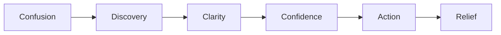

*If a feature doesn't move users through this arc faster, it doesn't ship.*

## 2.3 Engineering Principles

- **Research → Design → Build loop**, validate with 5 real users, measure behavior not satisfaction.
- **Modular monolith first**; boundaries enforced in code; extraction is a deployment change.
- **Reversible decisions**; **partition from day one**; **idempotency non-negotiable** on payment endpoints.

## 2.4 UX & Design Principles

Every screen has one job · every interaction is intentional · design by subtraction · loading states feel like progress.

## 2.5 The Test of Every Feature *(confirmed)*

Must answer **yes** to all five: reduces friction · builds trust · measurable within 14 days · simplest implementation · worthy of the standard.

---

# 3. PRODUCT FEATURES

Eight primary features, consistent schema: *Description · Purpose · Benefits · Dependencies · Status.*

## 3.1 Feature Index

| # | Feature | Spec Maturity | Beneficiary |
|---|---|---|---|
| 5.1 | Geo Discovery Engine | Detailed | Clients/Brands |
| 5.2 | Slot Availability Engine | Detailed | Clients+Creators |
| 5.3 | Review Completion System | Detailed | All |
| 5.4 | AI Budget Estimator | Detailed | Clients |
| 5.5 | Freelancer Discovery & Matching | Detailed | Creators/Agencies |
| 5.6 | Trust Infrastructure | Detailed | All |
| 5.7 | One Connected Workflow | Conceptual | All |
| 5.8 | Brand Deal Infrastructure | Detailed | Content Creators/Brands |
| **Growth & Retention features (v4.0)** — see [§3.10](#310-growth--retention-features-v40) | | | |
| G1 | Shortlist + Compare + Re-engagement | `Proposed` | Clients |
| G2 | Gallery Proofing & Delivery | `Proposed` | Creators (retention keystone) |
| G3 | AI Concierge | `Proposed` | Clients |
| G4 | Quote / Inquiry without booking | `Proposed` | Clients + Creators |
| G5 | Milestone / Installment Escrow | `Proposed` | Clients |
| G6 | Cancellation Protection (add-on) | `Proposed` | Clients |
| G7 | Add-on Marketplace | `Proposed` | Creators (AOV) |
| G8 | Referral Program | `Proposed` | All (growth) |
| G9 | Real Weddings / Blog (SEO) | `Proposed` | Demand (SEO) |
| G10 | Vendor Marketplace Expansion | `Proposed` | Platform (long game) |
| **Money-logistics features (v4.1)** | | | |
| G11 | Reschedule (booking date change) | `Proposed` | Clients + Creators (state-machine gap fix) |
| G12 | Split / Group Payments | `Proposed` | Clients (family-funded weddings) |
| G13 | EMI / Pay-Later (client financing) | `Proposed` | Clients (conversion on large bookings) |

## 3.2 Geo Discovery Engine

Location-aware search (radius + style/budget/availability/rating filters). Geolocation/manual city → Algolia geo query → filtered → ranked by distance + relevance + trust + recency → SSR result page (Google-indexable). SSR is a **customer-acquisition** decision (organic CAC 10–20× cheaper in Tier-2). **Deps:** Algolia, Next.js SSR, trust score, slot flag.

## 3.3 Slot Availability Engine

Real-time per-creator calendar removing the inquiry round-trip. State machine `OPEN → SOFT_HOLD (15-min Redis TTL) → PAYMENT_PENDING → CONFIRMED → COMPLETED → REVIEWED`; auto `SOFT_HOLD → OPEN` on expiry. **Deps:** `creator_slots` (month-partitioned), Redis, bookings, payments.

## 3.4 Review Completion System

Structured, behavior-triggered, incentivized reviews; target **65%+**. Triggered 48h after `COMPLETED`; star + dimension ratings + prompted text + photo; moderation queue; one creator response within 7 days; per-creator-type calibration. **Trust Score** = `(rating ×0.40 + completion ×0.20 + response_time ×0.15 + reliability ×0.15 + completeness ×0.10) ×100`.

## 3.5 AI Budget Estimator

7-step wizard → `claude-sonnet-4-6` (server-side, JSON-only) → low/recommended/premium + per-service breakdown + cost factors + matched listings. Seasonal multipliers (Oct–Feb), city-tier adjustment. Continuous learning loop on estimate-vs-actual delta. 24h Redis cache.

## 3.6 Freelancer Discovery & Matching

Two-sided matching (creators↔collaborators, agencies↔freelancers). Inputs = project requirements × creator signals → ranked matches + compatibility score + "worked together before." AI portfolio style classification via Claude Vision on R2 upload.

## 3.7 Trust Infrastructure

*"Trust is not a feature. It is the product."* Identity verification (Aadhaar, badged), EXIF spot-checks, reviews, escrow, dispute resolution. Payment state machine `BOOKING_INITIATED → ADVANCE_PAID → SHOOT_CONFIRMED → DELIVERY_IN_PROGRESS → DELIVERY_CONFIRMED → BALANCE_RELEASED → COMPLETED → REVIEW_PROMPTED`; dispute path to `RESOLVED_FOR_CLIENT | RESOLVED_FOR_CREATOR | PARTIAL_RESOLUTION`. Targets: dispute <2%, satisfaction >85%.

## 3.8 One Connected Workflow

Umbrella: Search → Profile → Slot → Budget → Book+Pay → in-app chat → delivery confirm → balance release → review → done.

## 3.9 Brand Deal Infrastructure

Dedicated UGC/social layer. Extended profile (niches, platforms, formats, verified audience metrics, structured rate card, policies). Workflow: brand search → AI fit score → brief (form/PDF) → AI Brief Parser → accept/negotiate → auto-contract → escrow (full, or 50% advance if >₹50K) → draft⇄revision (capped) → approve → deliver → balance release (T+1) → review. **Fit Score** = `(niche ×0.30 + audience ×0.25 + engagement ×0.20 + experience ×0.15 + trust ×0.10) ×100` shown as Strong/Good/Partial. Deliverable state machine `BRIEF_SENT → UNDER_NEGOTIATION → AGREED → ADVANCE_HELD → DRAFT_SUBMITTED ⇄ REVISION_REQUESTED → APPROVED → DELIVERED → BALANCE_RELEASED → COMPLETED → REVIEW_PROMPTED`.

---

## 3.10 GROWTH & RETENTION FEATURES (v4.0)

> All features in §3.10 are **`Proposed`** — concrete enough to build and challenge, pending product ratification. Each plugs into the existing stack; SQL lives in [§17.6](#176-growth--retention-tables-v40), new queues in [§8.5](#85-infrastructure--payments), build order in [§20.4](#204-growth-feature-build-sequence-v40). They are sequenced to first **capture explorers**, then **retain creators**, then **grow GMV**, then **scale demand**, then **expand**.

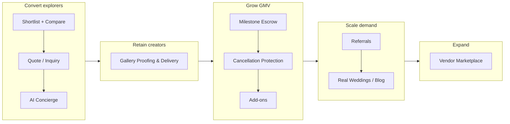

### 3.10.1 Shortlist + Compare + Re-engagement
- **Goal:** ~80% don't book on the first visit (slow, multi-person wedding decisions). Capture intent, accelerate the decision, bring them back. Feeds the discovery→booking funnel.
- **Flow:** Save creator → `wishlist`; Compare 2–3 side by side (price, style tags, trust, next-available, response time); share a read-only shortlist link (couple + family decide together); watch availability/price → re-engagement nudge.
- **How:** authenticated save → `wishlist`; visitor save in `localStorage`, merged on signup. BullMQ `engagement` queue (daily) fires nudges on: date opens, price-band drop, "booking fast" (N holds/7d), 3-day no-return — all respecting notification prefs.
- **Module:** extends `creators`; tables `wishlist`, `shortlists`.
- **Acceptance:** save persists + merges on signup; compare ≤3 creators in <400 ms on cache hit; each nudge ≤1×/creator/7d and obeys opt-outs; shared shortlist viewable only via signed URL.

### 3.10.2 Gallery Proofing & Delivery — *retention keystone*
- **Goal:** photographers deliver via Pixieset/Drive today, so the platform loses the most emotional moment and must *ask* for delivery confirmation. Bringing delivery in-platform makes **`DELIVERY_CONFIRMED` automatic** and makes creators dependent on Sceneora.
- **Flow:**
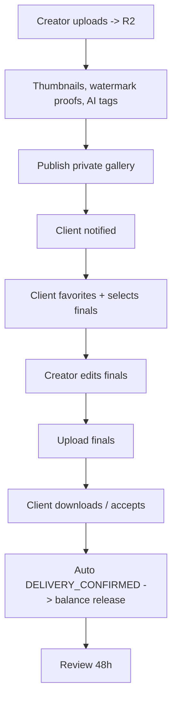
- **How:** presigned direct-to-R2 multipart upload (keeps large files off the API); reuse `aiPortfolioTag` for thumbnails/tags; client `accept`/download deterministically transitions `DELIVERY_IN_PROGRESS → DELIVERY_CONFIRMED`; inactivity auto-confirm after N days (e.g. 7, with reminders) keeps escrow moving. Storage caps map to Free/Pro/Studio plans (§10).
- **Module:** new `galleries`; tables `galleries`, `gallery_assets`; queue `galleryProcessing`.
- **Acceptance:** 500-image upload succeeds via presigned multipart without API memory pressure; `accept`/download deterministically sets `DELIVERY_CONFIRMED` + queues release; inactivity auto-confirm only after window + reminders; proofs watermarked, finals not.

### 3.10.3 AI Concierge — "describe your event, get matched"
- **Goal:** collapse search + budget + matching into one natural-language step. Almost entirely reuse of existing Claude + Budget Estimator + Matching — build cost is orchestration + UI.
- **Flow:** free text (+optional voice) → Claude extracts `EventParams` → ≤2 clarifying questions if needed → Budget Estimator (range) + Matching (ranked creators) → curated shortlist with "why this fits."
- **How:** single structured-output Claude call feeding the same `EventParams` the estimator consumes; reuses `budget:est:{hash}` and `fit:score` caches; all server-side, rate-limited.
- **Module:** thin `concierge` orchestrator over `budget-ai` + `matching`; table `concierge_sessions`.
- **Acceptance:** one realistic sentence → budget range + ≥3 matches in <4 s; ≤2 clarifying questions; visitor sessions merge on signup; key never client-exposed.

### 3.10.4 Quote / Inquiry without full booking
- **Goal:** many bookings need a conversation first ("2-city wedding?"). Keep it in-platform instead of leaking to WhatsApp; feed response time into trust score.
- **Flow:** structured quote request (date, scope, budget, message) → creator sends custom quote (line items → total) → client accepts → **soft hold + Razorpay order** (existing booking path).
- **How:** `inquiries` + `quotes`; threaded chat via `messaging`; response time → `response_time_score`; unanswered inquiries auto-expire (`inquiryExpiry` queue).
- **Module:** new `inquiries`.
- **Acceptance:** accepting a quote atomically creates a soft hold + idempotent order; unanswered inquiries expire on schedule; response time updates trust score.

### 3.10.5 Milestone / Installment Escrow
- **Goal:** ₹3L+ is hard to commit in two chunks; advance → mid → balance (each escrowed, released on milestones) lowers the barrier and raises booking size. Extends the §11 payment state machine.
- **How:** booking carries `milestones[]`; each is its own escrow hold + idempotent order; release rules attach to booking states (mid on `SHOOT_CONFIRMED`, balance on `DELIVERY_CONFIRMED`); disputes can target a single milestone.
- **Module:** extends `payments`; table `booking_milestones`.
- **Acceptance:** each milestone independently escrowed/released/refunded/disputable; sum equals booking total (enforced server-side).

### 3.10.6 Cancellation Protection (add-on)
- **Goal:** directly attacks the #1 fear — *"what if they don't show up."* Optional fee turns fear into a paid safety net + trust signal.
- **How:** opt-in fee at checkout; on **creator** cancel/no-show → auto full refund + priority rebooking pool (same-date, similar-tier, verified) + reliability-score penalty.
- **Module:** extends `payments` + `bookings` (`protection_opted`, `protection_fee_paise`).
- **Acceptance:** protected creator-cancel auto-refunds + surfaces ≥3 same-date alternatives where available; reliability penalty reflected in ranking.

### 3.10.7 Add-on Marketplace
- **Goal:** raise average order value with near-zero new infra — albums, prints, drone, extra hours, second shooter, rush delivery.
- **How:** creators define add-ons; clients add at/after checkout; amounts fold into the same escrow + take-rate + invoices.
- **Module:** new `addons`; tables `creator_addons`, `booking_addons`.
- **Acceptance:** add-ons recompute total, fee/GST, payout correctly and appear on the invoice.

### 3.10.8 Referral Program
- **Goal:** compound the flywheel cheaply — word-of-mouth is already the industry's main channel; make it trackable and rewarded.
- **How:** referral code/link; on the referred user's **first completed, paid booking**, both get a wallet credit (against fee or subscription); anti-abuse dedupe by device/payment instrument; reward only on completed+paid.
- **Module:** new `referrals`; tables `referrals`, `wallet_credits`; queue `referralQualify`.
- **Acceptance:** reward issues only after first completed paid booking; credits apply to fees/subscriptions with expiry; self-referral blocked.

### 3.10.9 Real Weddings / Blog (SEO + Inspiration)
- **Goal:** featured shoots become durable SEO landing pages + inspiration in the strongest acquisition channel, tagging involved creators (discovery + backlinks).
- **How:** editorial entries as SSG/ISR pages with schema.org (Article/ImageGallery); source from completed galleries with consent; tag creators → profile links.
- **Module:** new `content`; table `stories`; pages under `(marketing)/real-weddings`.
- **Acceptance:** story pages server-rendered, indexable, valid schema markup, link to tagged creators.

### 3.10.10 Vendor Marketplace Expansion — *the long game*
- **Goal:** the path from "photographer app" to **"wedding operating system."** Decor, catering, MUA, venues on the *same* trust/escrow/booking/review rails.
- **Flow:** "Plan my wedding" → pick categories → discover per category → assemble a multi-vendor wedding plan → escrow per vendor/milestone → one timeline → each vendor delivers + reviewed.
- **How:** `vendor_category` taxonomy + category-specific profile fields; slots/escrow/reviews/disputes reused unchanged; matching extends to bundles.
- **Module:** generalize `creators` → `vendors`; column `creators.vendor_category`; table `wedding_plans`.
- **Acceptance:** new vendor category added via config without rewriting booking/payment/review; a wedding plan aggregates multiple vendor bookings into one timeline.

### 3.10.11 Reschedule (booking date change) — *fixes a state-machine gap*
- **Goal:** the booking/slot state machines only model **confirm** or **cancel** — but Indian weddings are routinely **postponed** (date/muhurat shifts, family reasons). Today that forces cancel + rebook → refund friction, lost escrow continuity, and an unfair reliability penalty for a creator who did nothing wrong. Reschedule closes this hole.
- **State-machine addition:** `CONFIRMED → RESCHEDULE_REQUESTED → (both agree) RESCHEDULED → CONFIRMED(new date)` | `(declined) → cancellation policy / dispute`. The slot engine atomically **releases the old slot and holds the new** in one transaction; escrow + milestones (§3.10.5) carry over untouched.
- **Flow:**
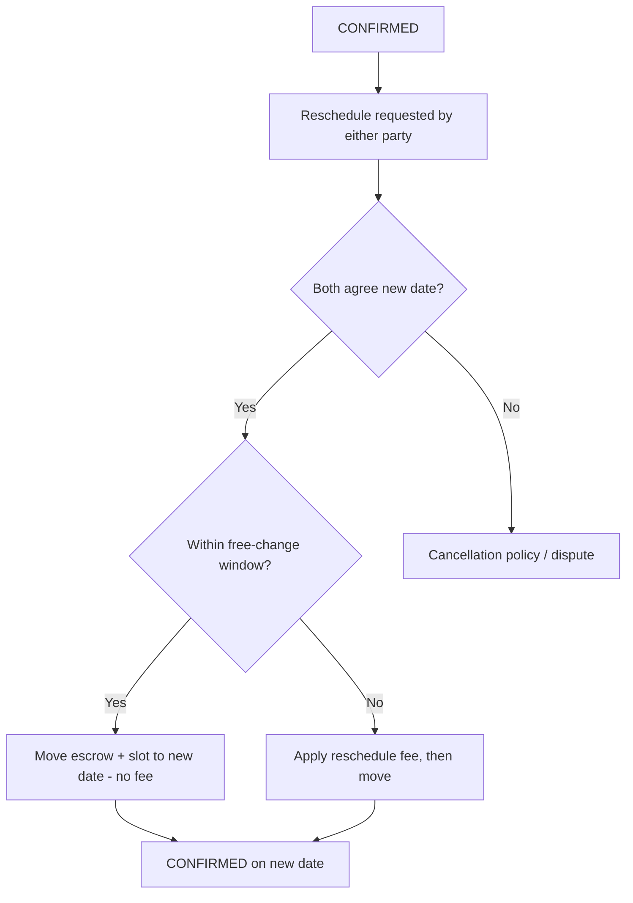
- **Policy:** free reschedule if > X days out (e.g. 30); a configurable fee inside the window; a per-booking reschedule cap (e.g. 2) to prevent abuse; reschedule does **not** apply a reliability penalty when mutually agreed.
- **Module:** extends `bookings` + `slots`; table `booking_reschedules`; new booking statuses `reschedule_requested`, `rescheduled`.
- **Acceptance:** old slot frees and new slot holds atomically (no double-book, no orphaned hold); escrow/milestones persist across the move; mutually-agreed reschedule applies no reliability penalty; reschedule cap enforced.

### 3.10.12 Split / Group Payments
- **Goal:** Indian weddings are **family-funded** — the bride's side and groom's side (or several relatives) often each pay a share. Forcing one payer is a real conversion blocker. Split payments let multiple people fund one escrow.
- **Flow:** booking owner sets co-payers + share amounts → each co-payer pays their share via their **own** idempotent Razorpay order → booking advances to `ADVANCE_PAID` once collected shares ≥ required advance → refunds/disputes settle **proportionally** to each payer.
- **How:** `payment_splits` rows, one per payer; each split is an independent order/payment; soft hold extended while collection is in progress (configurable window); partial-collection states surfaced to the owner ("₹X of ₹Y collected"); proportional refund on cancellation/dispute.
- **Module:** extends `payments`; table `payment_splits`.
- **Acceptance:** booking confirms only when collected shares meet the advance threshold; each share is independently paid/refunded; refunds are proportional; hold-extension window enforced and abandoned splits reopen the slot.

### 3.10.13 EMI / Pay-Later (client financing)
- **Goal:** ₹3L upfront is the single biggest conversion killer on large bookings. Offering EMI / pay-later at checkout lets clients spread cost while the **creator is still paid normally** — the financing sits between client and lender, not the creator.
- **Flow:** at checkout for bookings ≥ threshold (e.g. ₹50,000) → show affordability options (Razorpay EMI / cardless EMI / pay-later partners) → client selects a plan → lender disburses → platform receives the **full amount** → normal escrow + payout path proceeds unchanged.
- **How:** Razorpay EMI / Affordability Suite; `financing_method` flag on the booking/payment; escrow and creator payout logic untouched (platform is funded in full by the lender); reconciliation via the existing Razorpay webhook. Pairs naturally with milestone escrow (§3.10.5).
- **Module:** extends `payments`; columns `bookings.financing_method`, `payments.financing_provider`.
- **Acceptance:** EMI options surface only above the threshold; creator payout and escrow timing are identical to a full payment; financing method recorded on the payment; webhook reconciliation idempotent.

### 3.10.14 Additional Recommendations (radar)

| # | Idea | How it works | Why it matters |
|---|---|---|---|
| A | "Notify me when available" waitlist | Watch a booked date; alert if it frees | Recovers demand lost to unavailability |
| B | Collaborative shortlist voting | Couple + parents vote/comment on saved creators | Matches the real multi-person decision unit |
| C | Saved searches + alerts | Persist a search; notify on new matches | Brings users back; low effort |
| D | **WhatsApp booking assistant** | BSP bot mirrors inquiry/booking over WhatsApp | Meets India where it transacts |
| E | Loyalty / repeat-booking credit | Auto-credit on Nth booking with same client | Retention + LTV |
| F | AI seasonal pricing suggestions | Claude suggests price tweaks by demand/season | Helps creators earn; differentiator |
| G | Verified video reviews | Short client video testimonials tied to a booking | Highest-trust social proof |
| H | Dispute-prevention check-ins | Auto nudges at shoot/delivery milestones | Cuts disputes before they start |
| I | Creator payout advance (fintech) | Optional early payout for a fee, post-confirmation | Revenue line + creator loyalty |
| J | **Multi-language UI (Hindi/Tamil)** | Localized UI + DLT/WhatsApp templates | Tier-2/3 reach (core market) |
| K | Calendar sync (Google) | Two-way availability sync | Stops stale calendars / double-booking |
| L | Contracts & e-signature for bookings | Auto-contract from terms, e-signed, stored as evidence | Extends brand-deal contracts to all bookings |

## 3.11 Core-Feature Acceptance Criteria `Proposed`

> Parity with §3.10 — testable criteria for the original eight features (§3.2–3.9), so QA has the same coverage across all features.

| Feature | Acceptance criteria (must all pass) |
|---|---|
| **5.1 Geo Discovery** | Search by city+service returns geo-ranked results in <100 ms (Algolia); result page is server-rendered and fully crawlable (HTML present without JS); filters (style/budget/availability/rating) compose correctly; ranking reflects distance + trust + recency + availability. |
| **5.2 Slot Engine** | Selecting an OPEN date creates a Redis soft-hold visible to all viewers within 1 s; hold auto-expires at 15 min and reopens the slot with no creator action; a confirmed booking marks the date BOOKED; **double-booking is impossible** under concurrent holds (verified by concurrency test). |
| **5.3 Review System** | Review prompt fires exactly 48 h after `COMPLETED`; structured form enforces star + dimension ratings; one creator response allowed within 7 days; published review updates trust score and re-syncs Algolia; flagged reviews enter moderation, not the public profile. |
| **5.4 AI Budget Estimator** | 7-step wizard returns low/recommended/premium + per-service breakdown + matched listings in <4 s; output is valid JSON to schema; seasonal + city-tier multipliers applied; identical inputs served from 24 h cache. |
| **5.5 Matching** | Multi-requirement search returns ranked creators with a compatibility score and "worked together before" flag where applicable; portfolio uploads receive AI style tags before appearing in style-filtered search. |
| **5.6 Trust Infrastructure** | Escrow releases balance only after `DELIVERY_CONFIRMED`; every payment mutation is idempotent (duplicate request → single charge, verified); dispute can be raised from any post-advance state and routes to a Trust Officer with an evidence window; verified badge requires completed KYC. |
| **5.7 One Connected Workflow** | A booking can be completed end-to-end (discover → book → pay → chat → deliver → review) without leaving the platform; each step writes an auditable record. |
| **5.8 Brand Deal Infrastructure** | Brief (form or PDF) is AI-parsed into deliverables/rights/timeline; contract auto-generates on agreement; escrow funds before production; revision count enforced against the agreed cap; balance releases T+1 after brand confirmation. |

---

# 4. USER ROLES & AUTHORIZATION MODEL

## 4.1 Role Catalogue

| Role | Status | Description |
|---|---|---|
| **Visitor** | `Proposed` | Unauthenticated; browse SSR discovery/profiles, use budget estimator. |
| **Client** | confirmed | Discover, book, pay, review. |
| **Creator** | confirmed | Photographer/videographer/MUA/studio: profile, slots, bookings, delivery, payouts. |
| **Content Creator** | confirmed | Extended creator type; rate card, briefs, deliverables, brand deals. |
| **Brand** | confirmed | Search content creators, send briefs, fund escrow, approve deliverables. |
| **Agency** | confirmed | Manage roster, allocate freelancers, track payments. |
| **Studio** | confirmed | Multi-profile/team, multiple bookings. |
| **Subscriber (Pro/Studio/Brand+)** | `Proposed` | Any creator/brand on a paid plan — see [§10](#10-subscription--monetization-system). |
| **Moderator** | `Proposed` | Reviews/content moderation, dispute triage. |
| **Trust Officer** | `Proposed` | Dispute resolution, escrow release authority, verification approval. |
| **Admin** | `Proposed` | Full platform config, user lifecycle, finance, audit. |
| **Super Admin** | `Proposed` | Role/permission management, infra-level controls. |

## 4.2 Authorization Model `Proposed`

**RBAC with scoped claims**, enforced by NestJS Guards. JWT carries `sub`, `roles[]`, `subscription_tier`, `kyc_verified`. Resource-level checks (e.g. a creator may edit only their own slots) use ownership guards in addition to role.

```
Permission = f(role, resource_ownership, subscription_tier, kyc_status)
```

## 4.3 Permissions Matrix

| Capability | Visitor | Client | Creator | Content Creator | Brand | Agency | Moderator | Trust Officer | Admin |
|---|:-:|:-:|:-:|:-:|:-:|:-:|:-:|:-:|:-:|
| Browse discovery/profiles | ✅ | ✅ | ✅ | ✅ | ✅ | ✅ | ✅ | ✅ | ✅ |
| AI Budget Estimator | ✅ | ✅ | — | — | ✅ | ✅ | — | — | ✅ |
| Soft hold / book | ❌ | ✅ | — | — | — | ✅ | — | — | ✅ |
| Pay escrow | ❌ | ✅ | — | — | ✅ | ✅ | — | — | — |
| Manage own slots/profile | ❌ | ❌ | ✅ | ✅ | ❌ | ❌ | — | — | ✅ |
| Receive payouts | ❌ | ❌ | ✅ | ✅ | ❌ | ✅ | — | — | — |
| Send/parse brief | ❌ | ❌ | ❌ | receive | ✅ | ✅ | — | — | ✅ |
| Submit review | ❌ | ✅ | ❌ | ❌ | ✅ | ✅ | — | — | — |
| Respond to review (1×) | ❌ | ❌ | ✅ | ✅ | ❌ | ❌ | — | — | — |
| Raise dispute | ❌ | ✅ | ✅ | ✅ | ✅ | ✅ | — | — | — |
| Moderate reviews/content | ❌ | ❌ | ❌ | ❌ | ❌ | ❌ | ✅ | ✅ | ✅ |
| Resolve dispute / release escrow | ❌ | ❌ | ❌ | ❌ | ❌ | ❌ | ❌ | ✅ | ✅ |
| Manage plans / refunds / config | ❌ | ❌ | ❌ | ❌ | ❌ | ❌ | ❌ | ❌ | ✅ |

---

# 5. USER JOURNEYS

## 5.1 Canonical Top-Level Journey

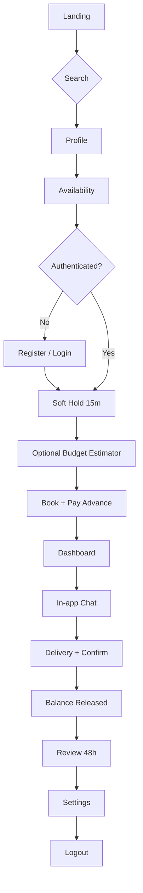

## 5.2 Client Booking Journey

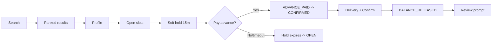

## 5.3 Creator Onboarding

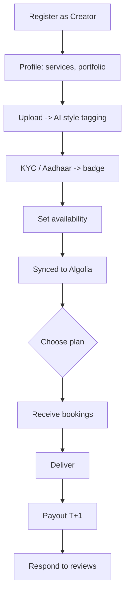

## 5.4 Brand Deal Journey

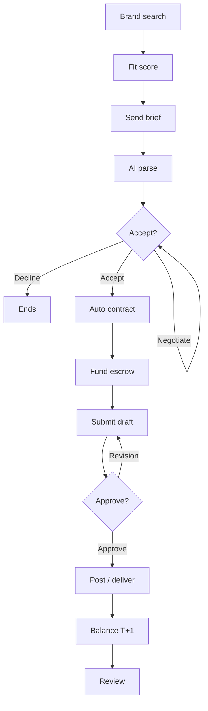

## 5.5 Dispute Journey

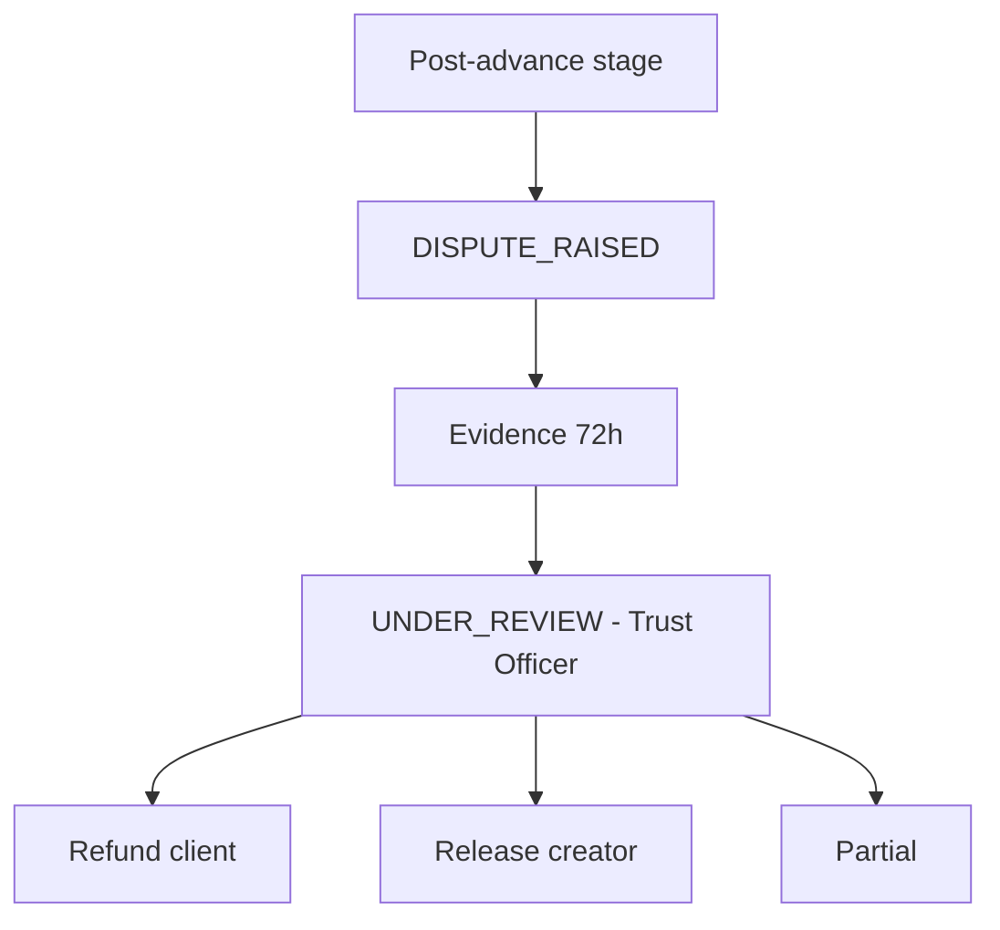

## 5.6 Subscription Journey `Proposed`

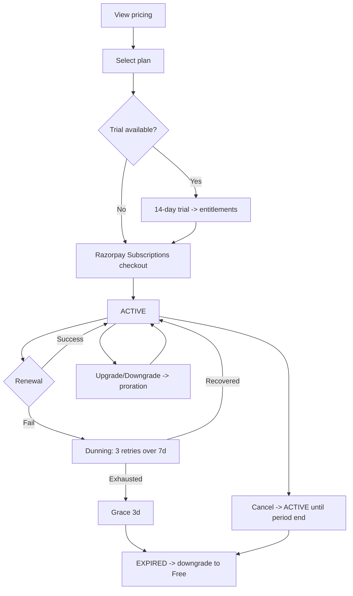

## 5.7 Role Portals & Operational Workflows `Proposed`

> This section specifies, **per actor**, how each portal works end-to-end: how an order/booking is received, how it is accepted, how available slots are surfaced, the financial dashboard, and the chatbox. Each role shares four common building blocks (§5.7.1) and then has its own portal (§5.7.2–5.7.7). Mobile behavior is in §5.7.8.

### 5.7.1 Shared building blocks (used by every portal)

| Block | What it does | Backed by |
|---|---|---|
| **Available-Slots widget** | Live calendar showing OPEN / HELD / BOOKED dates so a client never has to ask "are you free?" | `creator_slots` + Redis soft-hold (§3.3) |
| **Order/Booking intake** | A new booking, inquiry, or brand brief lands in the actor's portal + push/SMS/email | `bookings` / `inquiries` / `brand_deals` + notifications |
| **Accept / Decline** | Actor confirms or rejects; acceptance moves the state machine forward | booking/deal state machines |
| **Chatbox** | Real-time in-app chat per order (WebSocket), with attachments + audit trail | `messaging` module (§7.8.5) |
| **Financial dashboard** | Earnings/spend, escrow status, payouts, invoices, take-rate, refunds | `payments`, `transactions`, `invoices`, `subscriptions` |

### 5.7.2 Photographer / Creator portal

**How an order is received and accepted:**

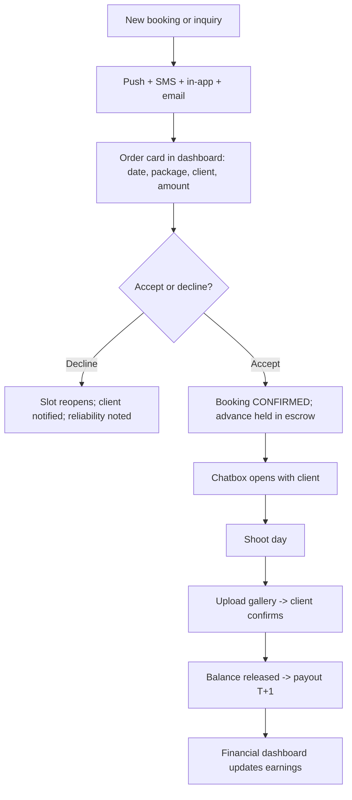

> **Note:** a *direct booking* (client paid advance) arrives already `CONFIRMED` — the creator "accepts" by acknowledging and coordinating. An *inquiry/quote* (§3.10.4) requires the creator to send a quote first; acceptance happens on the client side. Both paths are shown in the client portal (§5.7.3).

**Creator dashboard widgets:**

| Widget | Shows |
|---|---|
| Orders board | Pending / Confirmed / In-progress / Completed (kanban) |
| Availability calendar | Manage OPEN/blocked dates; see HELD/BOOKED; set working hours |
| Financial dashboard | This-month earnings, in-escrow (pending release), released payouts, take-rate by plan, next settlement date, lifetime GMV |
| Reviews | Rating by dimension, completion rate, respond once |
| Insights | Profile views, search impressions, conversion, ranking position |
| Plan | Current plan, take-rate, upgrade CTA (§10) |

**Creator financial dashboard flow:**

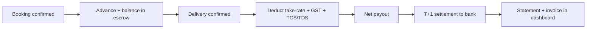

### 5.7.3 Client portal

**How a client discovers slots, orders, and tracks:**

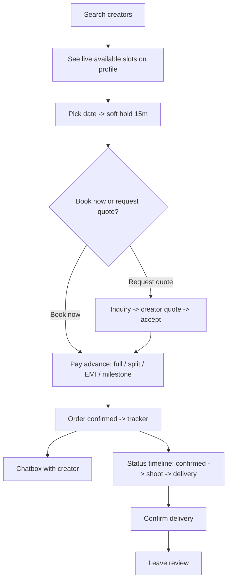

**Client dashboard widgets:** active orders + status timeline · upcoming shoot dates · chatbox · **payments & invoices** (paid, in-escrow, refunds, EMI schedule, split contributors) · saved shortlist (§3.10.1) · review prompts.

### 5.7.4 Content-Creator portal

Brand-deal intake → accept/negotiate → produce → financial:

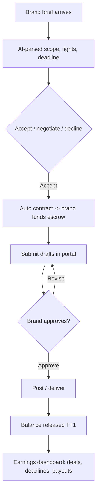

**Widgets:** active deals + deadlines (48h alerts) · rate card editor · audience metrics · deliverable tracker · earnings/payouts · chatbox per deal.

### 5.7.5 Brand portal

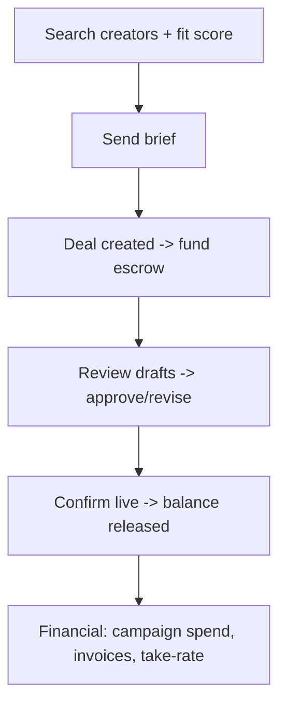

**Widgets:** active campaigns/deals · deliverable approvals · creator shortlist · **spend dashboard** (escrowed, released, invoices) · chatbox · plan (Brand/Brand+).

### 5.7.6 Agency portal

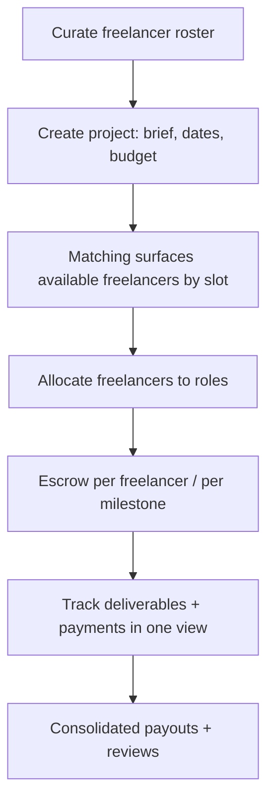

**Widgets:** roster · projects board · per-project allocation + availability · **consolidated financial** (per-freelancer payouts, project budgets, invoices) · chatbox per project.

### 5.7.7 Admin portal (operations)

Oversight of every order, dispute, and rupee (full capabilities in [§18](#18-admin--moderation-console-proposed)):

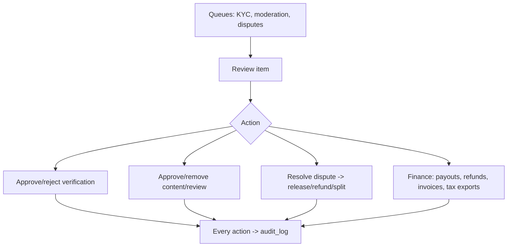

**Admin dashboard widgets:** platform KPIs (GMV, active orders, dispute rate, MRR) · KYC queue · moderation queue · disputes · **finance console** (payouts, refunds, invoices, tax) · users · audit log · feature flags.

### 5.7.8 Mobile portal flows (per role)

Mobile uses **role-aware tab navigation** over the same `/v1` API (§7.8). Order intake is **push-first** so creators never miss a booking.

| Role | Mobile tabs |
|---|---|
| Client | Search · Orders · Chat · Saved · Account |
| Creator / Content Creator | Orders · Calendar · Chat · Earnings · Account |
| Brand | Discover · Deals · Chat · Spend · Account |
| Agency | Projects · Roster · Chat · Finance · Account |
| Admin | (web-only — desktop console) |

**Creator mobile order-acceptance (push-driven):**

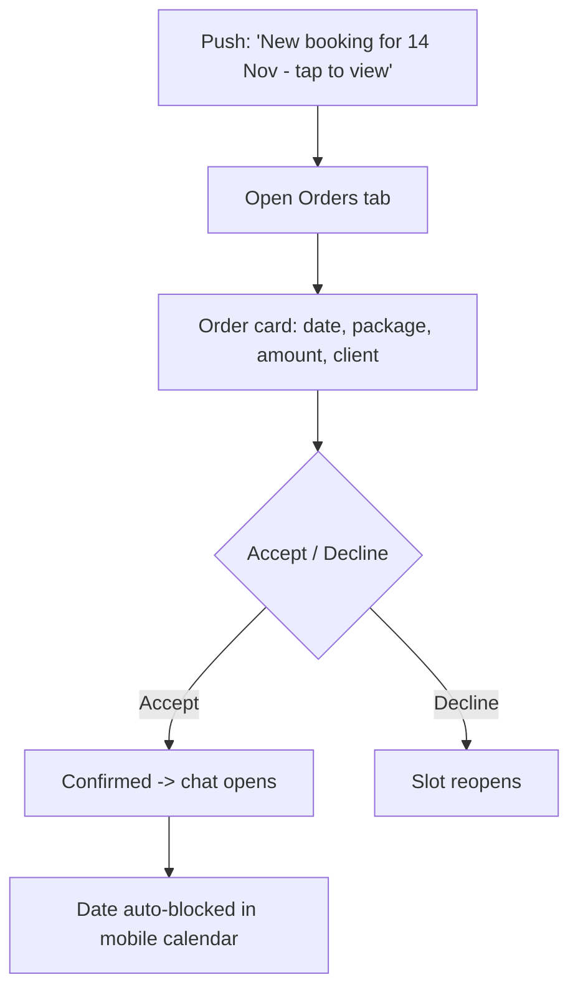

**Mobile specifics:** OTP autofill on login · camera roll → presigned R2 gallery upload (background) · biometric unlock for the financial/earnings tab · offline view of upcoming orders + queued chat that sends on reconnect (§7.8.3).

### 5.7.9 Available Slots — how a user always knows availability

The single biggest friction-killer. On every creator profile (web + mobile):

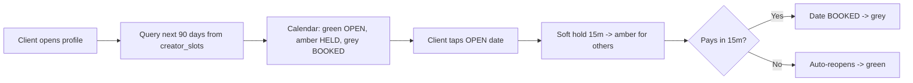

- **States are live** — no inquiry round-trip; a held date instantly shows as unavailable to everyone else (Redis soft-hold), preventing double-booking.
- Reschedule (§3.10.11) moves a BOOKED date back to OPEN and holds the new date atomically.
- "Notify me when available" waitlist (radar idea §3.10.14-A) can watch a BOOKED date.

---

# 6. INFORMATION ARCHITECTURE & NAVIGATION

## 6.1 Page Hierarchy *(confirmed + `Proposed` additions)*

```
app/
├── (marketing)/   page · about · rnd · pricing[Proposed]
├── (discovery)/   search · [city]/[service] · creator/[username]
│                  content-creators · content-creators/[username]
├── (booking)/     book/[creator_id] · checkout
├── (brand-deals)/ brief/[creator_id] · deals
├── (dashboard)/   client · creator · content-creator · agency[Proposed]
├── (account)/     settings · billing[Proposed] · notifications[Proposed] · security[Proposed]
├── (admin)/       admin · moderation · disputes · finance   [Proposed]
└── api/           auth callbacks · webhooks
```

## 6.2 Rendering Strategy *(confirmed)*

SSG (marketing) · SSR (search, SEO-critical) · ISR (city/service, profiles) · CSR (booking, checkout, dashboards, admin).

## 6.3 Global Navigation Model `Proposed`

| Surface | Elements |
|---|---|
| Public header | Logo · Search · Discover (Creators/Content Creators) · Pricing · Login/Register |
| Authenticated header | Logo · Search · Dashboard · Notifications bell · Messages · Avatar menu (Profile, Billing, Settings, Logout) |
| Creator/Brand sidebar | Overview · Bookings/Deals · Calendar · Earnings · Reviews · Plan · Settings |
| Footer | About · R&D · Pricing · Trust & Safety · Legal (Terms, Privacy, Refund, Grievance) · Support |

## 6.4 Feature Relationships

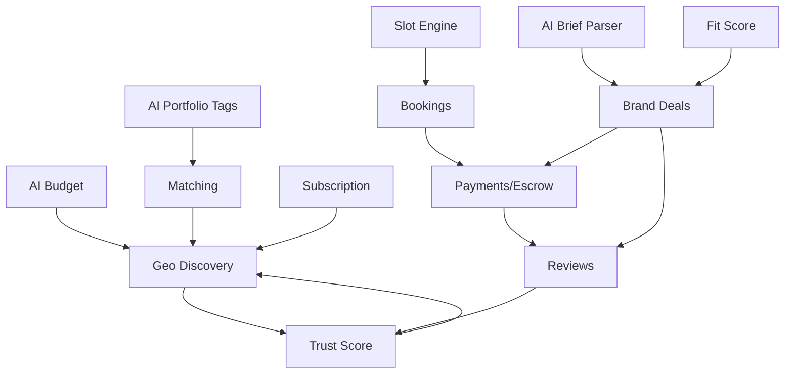

## 6.5 Web Screen / Navigation Map `Proposed`

Full screen tree for the web app (Next.js). Rendering strategy per route is noted (SSG/SSR/ISR/CSR per §6.2). Auth-gated screens are marked 🔒.

```mermaid
flowchart TD
    HOME[Home  SSG] --> SRCH[Search results  SSR]
    HOME --> CITY[City + Service landing  ISR]
    HOME --> PRICE[Pricing  SSG]
    HOME --> RND[R&D Story  SSG]
    HOME --> CONC[AI Concierge]
    SRCH --> PROF[Creator Profile  ISR]
    CITY --> PROF
    CONC --> PROF
    PROF --> SLOTS[Availability calendar]
    PROF --> CMP[Compare 2-3]
    PROF --> SAVE[Save to shortlist]
    PROF --> BOOK[Booking flow  CSR 🔒]
    PROF --> INQ[Request quote  🔒]
    BOOK --> CKO[Checkout: full / split / EMI / milestone  🔒]
    CKO --> CONF[Confirmation -> dashboard]

    HOME --> CCDISC[Content-Creator discovery  SSR]
    CCDISC --> CCPROF[Content-Creator profile + rate card  ISR]
    CCPROF --> BRIEF[Send brief  CSR 🔒]

    HOME --> AUTH[Login / Register / OTP / Reset]
```

**Authenticated areas (CSR, 🔒):**

```mermaid
flowchart TD
    DASH{Role dashboard} --> CLI[Client: orders, payments, invoices, shortlist, chat]
    DASH --> CRE[Creator: orders board, calendar, earnings, reviews, insights, plan, chat]
    DASH --> CC[Content-Creator: deals, deadlines, rate card, earnings, chat]
    DASH --> BR[Brand: campaigns, approvals, spend, shortlist, chat]
    DASH --> AG[Agency: projects, roster, allocation, finance, chat]
    ACCT[Account] --> SET[Settings] & SEC[Security / sessions] & BILL[Billing / plan] & NOTI[Notification prefs]
    ADM[Admin console  web-only] --> KQ[KYC] & MQ[Moderation] & DQ[Disputes] & FQ[Finance] & AUD[Audit] & FLAGS[Feature flags]
```

| Web zone | Screens | Render |
|---|---|---|
| Marketing | Home, About, R&D, Pricing, Trust & Safety, Real Weddings, Legal | SSG/ISR |
| Discovery | Search, City+Service, Creator profile, Content-creator discovery/profile, Concierge, Compare | SSR/ISR |
| Booking | Booking flow, Checkout, Confirmation | CSR 🔒 |
| Brand deals | Brief submission, Deals | CSR 🔒 |
| Dashboards | Client, Creator, Content-creator, Brand, Agency | CSR 🔒 |
| Account | Settings, Security, Billing, Notifications | CSR 🔒 |
| Admin | KYC, Moderation, Disputes, Finance, Audit, Flags | CSR 🔒 (desktop) |

## 6.6 Mobile App Screen / Navigation Map `Proposed`

The mobile app (React Native + Expo) uses a **role-aware bottom tab bar** (§5.7.8) over the same `/v1` API. Each role sees a different tab set; deep links and push open the relevant screen directly. Admin is **web-only** (no mobile tab).

### 6.6.1 Client app

```mermaid
flowchart TD
    subgraph Tabs[Bottom tabs]
        T1[Search] 
        T2[Orders]
        T3[Chat]
        T4[Saved]
        T5[Account]
    end
    T1 --> S1[Search + filters] --> S2[Profile] --> S3[Availability calendar]
    S3 --> S4[Soft hold -> Checkout]
    S1 --> CONC[AI Concierge]
    T2 --> O1[Order list] --> O2[Order detail: status timeline, contract]
    O2 --> O3[Confirm delivery -> review]
    T3 --> C1[Chat threads] --> C2[Conversation]
    T4 --> W1[Shortlist + Compare]
    T5 --> A1[Profile] & A2[Payments + invoices] & A3[Security] & A4[Notification prefs]
```

### 6.6.2 Creator / Content-Creator app

```mermaid
flowchart TD
    subgraph CTabs[Bottom tabs]
        K1[Orders]
        K2[Calendar]
        K3[Chat]
        K4[Earnings]
        K5[Account]
    end
    PUSH[Push: new booking] --> K1
    K1 --> KO[Orders board: pending / confirmed / in-progress / completed]
    KO --> KOA[Order detail -> Accept / Decline]
    KOA --> GAL[Upload gallery -> deliver]
    K2 --> CAL[Availability: open/block dates, working hours]
    K3 --> KC[Chat threads -> conversation]
    K4 --> EARN[Earnings: this month, in-escrow, payouts, settlement] --> STMT[Statements + invoices]
    K5 --> KA[Profile/portfolio] & KP[Plan + take-rate] & KR[Reviews] & KS[Security/biometric]
```

> Content-Creator app is the same shell with **Deals** in place of **Orders** (brief intake, draft submission, deadline alerts) and a **Rate card** editor under Account.

### 6.6.3 Brand & Agency apps

```mermaid
flowchart TD
    subgraph BTabs[Brand tabs]
        B1[Discover] --> B2[Deals] --> B3[Chat] --> B4[Spend] --> B5[Account]
    end
    B1 --> BF[Search + fit score -> send brief]
    B2 --> BD[Deal detail -> approve / revise drafts]
    B4 --> BSP[Spend: escrowed, released, invoices]

    subgraph GTabs[Agency tabs]
        G1[Projects] --> G2[Roster] --> G3[Chat] --> G4[Finance] --> G5[Account]
    end
    G1 --> GP[Project -> allocate freelancers by availability]
    G4 --> GF[Consolidated payouts + budgets + invoices]
```

### 6.6.4 Cross-app navigation rules `Proposed`

| Rule | Behavior |
|---|---|
| Tab set | Resolved from the user's role/claims at login |
| Push deep-link | Opens the exact screen (order, chat thread, deal) — not just the app |
| Auth | OTP autofill; biometric unlock required to enter Earnings/Spend/Finance tab |
| Media | Camera/gallery picker → presigned R2 background upload |
| Offline | Orders/calendar readable offline; chat + actions queue and replay on reconnect |
| Slots | Calendar tab shows OPEN/HELD/BOOKED live (same states as web, §5.7.9) |
| Versioning | Min-supported-version gate at login; OTA updates for JS-only changes |

## 6.7 SEO Requirements `Proposed`

> Organic search is the **#1 acquisition channel** (Tier-2 CAC 10–20× cheaper than paid). SEO is a first-class requirement, not an afterthought. This consolidates the rendering, markup, and indexing rules previously scattered across §3.2 and §3.10.9.

### 6.7.1 Rendering & indexability
- Discovery pages (search, city/service, profiles, content-creator profiles, Real Weddings) must render **full HTML server-side** (SSR/ISR/SSG per §6.2) — content present and crawlable **without JavaScript**.
- Auth-gated pages (booking, dashboards, admin) are `noindex`.

### 6.7.2 URL & metadata
- **Clean, keyword-rich URLs:** `/{city}/{service}` (e.g. `/coimbatore/wedding-photographers`), `/creator/{username}`, `/real-weddings/{slug}`.
- Per-page unique `<title>`, meta description, canonical tag (prevent duplicate city/service variants competing), Open Graph + Twitter cards for share previews.
- Pagination via `rel=next/prev` or canonical to a "view all" where appropriate.

### 6.7.3 Structured data (schema.org) per page type

| Page type | schema.org markup |
|---|---|
| Creator / content-creator profile | `LocalBusiness` + `AggregateRating` + `Review` |
| City + service landing | `ItemList` of creators + `BreadcrumbList` |
| Real Weddings story | `Article` + `ImageGallery` |
| Pricing | `Product`/`Offer` (plans) |
| Home / org | `Organization` + `WebSite` (+ `SearchAction` sitelinks box) |
| FAQ blocks | `FAQPage` |

### 6.7.4 Crawl & indexing infrastructure
- **Dynamic XML sitemaps** (segmented: creators, city/service, stories) regenerated on publish/update; submitted to Search Console.
- `robots.txt` allows discovery, disallows auth/admin/api.
- **ISR revalidation** keeps profile/listing pages fresh on booking/review without full rebuilds.
- `hreflang` tags for localized variants (ties to §15.3).
- Core Web Vitals targets (§14.1) are SEO ranking factors — enforced on all indexable pages.

### 6.7.5 Acceptance criteria
- Every indexable page returns valid HTML + correct canonical + valid structured data (Rich Results test passes).
- Sitemaps auto-update within the ISR window of a create/update.
- A new city/service page is crawlable and indexable on publish with no manual step.

---

# 7. SYSTEM ARCHITECTURE

## 7.1 Overall Architecture

```mermaid
flowchart TD
    subgraph Clients
        WEB[Next.js 14 Web]
        MOB[React Native + Expo]
    end
    WEB --> CF[Cloudflare CDN + WAF]
    MOB --> CF
    CF --> API[NestJS Modular Monolith - ECS Fargate ap-south-1]
    API --> PG[(PostgreSQL RDS + pgbouncer + replicas)]
    API --> RD[(Redis)]
    API --> ALG[Algolia]
    API --> Q[BullMQ]
    API --> RZP[Razorpay - escrow + payouts + subscriptions]
    API --> CLD[Claude API]
    API --> R2[Cloudflare R2]
    Q --> NOTIF[Notifications: Push / SMS Exotel / Email Resend / WhatsApp]
    Q --> ALG
    RZP -- webhook HMAC --> API
    API --> OBS[Observability: logs/metrics/traces]
```

## 7.2 Module Architecture *(confirmed + `Proposed`)*

```
src/modules/
  auth          users[Proposed]      creators        content-creators
  search        slots                bookings         brand-deals
  payments      billing[Proposed]    invoices[Proposed]  trust
  notifications matching             budget-ai        messaging
  analytics     admin[Proposed]      audit[Proposed]
src/common/  guards · interceptors · decorators · pipes · filters
```

## 7.3 Authentication Flow → see [§9](#9-authentication--authorization)
## 7.4 Payment Flow → see [§11](#11-payment-refund-invoice--tax-flow)
## 7.5 Subscription Flow → see [§10](#10-subscription--monetization-system)
## 7.6 Notification Flow → see [§12](#12-notification-system)

## 7.7 End-to-End Booking Data Flow *(confirmed)*

```mermaid
flowchart TD
    C[Search 'wedding photographer Coimbatore'] --> SSR[Next.js SSR]
    SSR --> ALG[Algolia geo+service+date] --> RANK[Rank: distance+trust+availability]
    RANK --> PROF[Profile -> NestJS -> PostgreSQL open slots]
    PROF --> HOLD[Soft hold 15m Redis] --> BUD[Optional Budget Estimator]
    BUD --> ORD[Razorpay order - idempotency key]
    ORD --> WH[Webhook -> BullMQ -> ADVANCE_PAID; slot CONFIRMED]
    WH --> NTF[SMS + Push] --> DLV[Delivery -> confirm -> balance released]
    DLV --> RP[BullMQ review prompt 48h] --> TS[Trust score recalc -> Algolia update]
```

## 7.8 Client Platform Workflows — Web & Mobile

> v1.0 named the web (Next.js) and mobile (React Native + Expo) stacks but never specified **how each client actually works end-to-end or how they share logic**. This section closes that. `Proposed` where it goes beyond v1.0.

### 7.8.1 Shared-core architecture *(confirmed + `Proposed`)*

~70% of logic is shared via `packages/core`; only UI is platform-native. One contract, two shells.

```mermaid
flowchart TD
    subgraph Shared[packages/core - shared TypeScript]
        API[API clients] 
        ST[Zustand stores]
        HK[business-logic hooks]
        UT[validators / formatters]
        TY[types / DTOs]
    end
    Shared --> WEB[apps/web - Next.js 14]
    Shared --> MOB[apps/mobile - Expo / React Native]
    WEB --> NEST[NestJS API /v1]
    MOB --> NEST
    WEB -. SSR/ISR only .-> NEST
```

A change to a booking rule, validation, or API contract is written **once** in `core` and both clients inherit it — no divergence.

### 7.8.2 Web request lifecycle

```mermaid
flowchart LR
    U[User] --> CF[Cloudflare edge cache]
    CF -- cache hit --> U
    CF -- miss --> NX[Next.js on Fargate]
    NX -- SSG/ISR page --> CACHE[(rendered HTML cache)]
    NX -- SSR data --> API[NestJS API]
    NX -- CSR hydration --> API
    API --> DB[(PG read replica)]
    API --> RD[(Redis)]
```

- **SSG/ISR** (marketing, city/service, profiles) served from edge/ISR cache → most discovery traffic never touches the app DB.
- **SSR** (search) hits the API live for fresh facets.
- **CSR** (booking, checkout, dashboards) calls the API directly post-auth.

### 7.8.3 Mobile request lifecycle

```mermaid
flowchart LR
    M[Expo app] --> Q{Network?}
    Q -- online --> API[NestJS API /v1]
    Q -- offline --> LC[(local cache / queue)]
    LC -. on reconnect .-> API
    API --> DB[(PG)]
    M --> PUSH[FCM / APNs push]
    M --> R2[Presigned direct-to-R2 upload]
```

- Talks to the **same `/v1` API** as web (no mobile-only backend).
- **Native capabilities** (`Proposed`): camera/gallery picker for portfolio + gallery uploads, push notifications, deep links, OTP SMS autofill, biometric unlock, background upload.
- **Offline-tolerant** (`Proposed`): read-cache for dashboards/itineraries; queued mutations replay on reconnect with the same idempotency keys (safe to retry).

### 7.8.4 Platform responsibility & parity matrix `Proposed`

| Capability | Web | Mobile | Notes |
|---|:-:|:-:|---|
| SEO discovery (SSR/ISR) | ✅ | — | Web owns organic acquisition |
| Search + filters | ✅ | ✅ | Shared API |
| Booking + checkout | ✅ | ✅ | Razorpay web checkout / RN SDK |
| Gallery upload (large/RAW) | ✅ | ✅ | Mobile: camera roll → presigned R2 multipart |
| Push notifications | Web Push | FCM/APNs | In-app inbox shared |
| In-app chat (WebSocket) | ✅ | ✅ | Shared store |
| OTP autofill / biometric | — | ✅ | Native only |
| Offline read + queued writes | limited | ✅ | Mobile-first |
| Admin console | ✅ | — | Desktop-only |

### 7.8.5 Real-time & media

- **Chat / live booking status:** WebSocket gateway (`messaging` module) with the same Zustand store on both clients; reconnect with backoff; presence via Redis.
- **Media:** all uploads go **direct to R2 via presigned URLs** (never proxied through the API), so a 500-image gallery upload from a phone on 4G doesn't load the app tier. Cloudflare optimizes delivery; thumbnails via the `galleryProcessing` queue.

### 7.8.6 Release & versioning `Proposed`

- Mobile: EAS Build + **OTA updates** (Expo Updates) for JS-only changes; store submission only for native changes. API is **versioned (`/v1`)** so old app versions keep working; deprecations are announced and gated by a minimum-supported-version check returned at login.

---

# 8. TECHNOLOGY STACK

## 8.1 Frontend Web
Next.js 14 App Router · TypeScript · Tailwind · Framer Motion (no rotation/spin) · GSAP ScrollTrigger. SSR/ISR/SSG/RSC for SEO + low-end Android.

## 8.2 Mobile
React Native · Expo (EAS Build) · ~70% shared logic. Chosen for Android fragmentation (200+ models), Mac-less iOS signing, single codebase. Shared `packages/core` (api, Zustand stores, hooks, utils, types).

## 8.3 Backend
Node.js · NestJS modular monolith (microservice-ready).

## 8.4 Data Layer
PostgreSQL (RDS) + pgbouncer + replicas · Redis · Algolia → OpenSearch at **500K searches/mo or $3,000/mo**.

## 8.5 Infrastructure & Payments

| Component | Choice | Reason |
|---|---|---|
| Region | AWS ap-south-1 (Mumbai) | Latency + compliance |
| Compute | ECS Fargate | No K8s overhead at seed |
| CDN/WAF | Cloudflare | DDoS, Indian PoPs, image opt |
| Storage | Cloudflare R2 | Zero egress |
| Payments | Razorpay | Split-payouts, UPI, escrow, **Subscriptions** `Proposed`, compliance |
| Queue | BullMQ | Kafka only at >10K events/sec |

Queues: notifications, algoliaSync, trustScoreUpdate, paymentWebhooks, aiPortfolioTag, reviewPrompt, slotExpiry, brandDealDeadline, briefParser, fitScoreRefresh, **subscriptionRenewal** `Proposed`, **invoiceGen** `Proposed`, **dunning** `Proposed`, **engagement** `Proposed`, **galleryProcessing** `Proposed`, **inquiryExpiry** `Proposed`, **referralQualify** `Proposed`.

## 8.6 AI Layer
Claude API (server-side only, key never client-exposed). Budget Estimator, Portfolio Classification (vision), Matching re-rank, Review Summary, Smart Inquiry Draft, Dispute Triage, Brief Parser, Fit Scoring — all `claude-sonnet-4-6`.

> **Model-ID note:** verify the current recommended Claude model id against the latest API reference before implementation.

---

# 9. AUTHENTICATION & AUTHORIZATION

> Confirmed primitives from v1.0: JWT, OAuth, Redis `session:{user_id}` (7-day TTL), NestJS Guards, auth callbacks under `api/`. Everything below marked `Proposed` is authored to close the gap.

## 9.1 Identity Methods `Proposed`

| Method | Use | Notes |
|---|---|---|
| **Phone + OTP** (primary) | India-first low-friction signup/login | OTP via Exotel SMS, 6-digit, 5-min TTL, 5 attempts |
| Email + Password | Brands/agencies, desktop | Argon2id hashing, min 10 chars, breach check |
| Google OAuth | Fast social login | OIDC |
| Apple OAuth | iOS requirement | OIDC |

## 9.2 Token Model `Proposed`

- **Access token (JWT):** 15-min TTL; claims `sub, roles[], subscription_tier, kyc_verified, jti`.
- **Refresh token:** 7-day TTL (matches confirmed session TTL), rotating, stored hashed in `sessions`; reuse detection revokes the family.
- Session record in Redis `session:{user_id}` + persistent `sessions` table for device/audit.

## 9.3 Registration Flow `Proposed`

```mermaid
flowchart TD
    A[Enter phone/email + role] --> B[Send OTP / verify email]
    B --> C{Verified?}
    C -- No --> A
    C -- Yes --> D[Create user - status pending_profile]
    D --> E[Issue tokens] --> F[Role-specific onboarding]
    F --> G[Creator -> KYC + profile; Client -> ready]
```

## 9.4 Login Flow `Proposed`

```mermaid
flowchart TD
    A[Phone/email or OAuth] --> B{Method}
    B -- OTP --> C[Verify OTP]
    B -- Password --> D[Verify Argon2id]
    B -- OAuth --> E[Verify OIDC token]
    C & D & E --> F{Valid?}
    F -- No --> X[Reject + rate-limit]
    F -- Yes --> G{MFA enabled?}
    G -- Yes --> H[Second factor]
    G -- No --> I[Issue access+refresh] --> J[Create session]
```

## 9.5 Password Reset `Proposed`

Request → email/SMS one-time link/code (15-min TTL, single-use) → verify → set new password (Argon2id) → revoke all existing sessions → notify user of change.

## 9.6 Session Management `Proposed`

- List active sessions (device, IP, last seen) in Account → Security.
- Revoke single / all sessions; refresh-token rotation with reuse detection.
- Idle timeout 7 days; absolute max 30 days then re-auth.

## 9.7 MFA `Proposed`

Optional TOTP (authenticator app) for Brands/Agencies/Admins; mandatory for Admin/Trust Officer/Super Admin roles. Recovery codes issued at enrollment.

## 9.8 KYC / Aadhaar Verification `Proposed`

Confirmed as an optional trust badge in v1.0. Flow: creator submits Aadhaar → DigiLocker/OTP-based verification (no raw Aadhaar number stored; store masked + verification token) → `kyc_verified=true` → badge. See PII rules in [§13](#13-security--data-protection).

## 9.9 Protected Routes & Guards `Proposed`

| Guard | Enforces |
|---|---|
| `JwtAuthGuard` | Valid access token |
| `RolesGuard` | Required role(s) from JWT |
| `OwnershipGuard` | Actor owns the resource |
| `KycGuard` | `kyc_verified` for payout-enabling actions |
| `SubscriptionGuard` | Entitlement for plan-gated features |

---

# 10. SUBSCRIPTION & MONETIZATION SYSTEM `Proposed`

> **This entire section is `Proposed`.** v1.0 specified only escrow/per-transaction economics (no subscription model). Below is a complete, ratify-before-build monetization spec consistent with the confirmed Razorpay + marketplace architecture.

## 10.1 Revenue Model — Hybrid

| Stream | Mechanism |
|---|---|
| **Take-rate (commission)** | Platform fee deducted at escrow release: **default 12%** on bookings, **15%** on brand deals (configurable by plan). |
| **Subscriptions** | Optional recurring plans reducing take-rate and unlocking growth features. |
| **Add-ons** | Featured placement, additional team seats, priority support (one-off or recurring). |

## 10.2 Plan Matrix

### Creator / Content-Creator Plans

| Feature | Free | Pro (₹499/mo) | Studio (₹1,499/mo) |
|---|---|---|---|
| Profile + listing | ✅ | ✅ | ✅ |
| Take-rate | 12% | 8% | 6% |
| Slots/month | Unlimited | Unlimited | Unlimited |
| Portfolio media | 20 | 200 | Unlimited |
| AI style tagging | Basic | Full | Full |
| Featured search boost | — | ✅ (weekly) | ✅ (daily) |
| Analytics dashboard | Basic | Advanced | Advanced + export |
| Team seats | 1 | 3 | 15 |
| Priority support | — | Email | Email + chat |

### Brand Plans

| Feature | Brand Free | Brand+ (₹2,999/mo) |
|---|---|---|
| Search & briefs | ✅ | ✅ |
| Brand-deal take-rate | 15% | 10% |
| Active campaigns | 2 | Unlimited |
| AI fit scoring | Basic | Advanced |
| Bulk outreach | — | ✅ |

> Prices are **`Proposed` placeholders** for ratification. Annual billing `Proposed` at ~2 months free (−17%).

## 10.3 Billing Engine

- **Provider:** Razorpay Subscriptions (plans + subscriptions API) for recurring; existing Razorpay orders for one-off add-ons.
- **Cadence:** monthly or annual; auto-renew via UPI AutoPay / card mandate (e-NACH where applicable).
- **Trials:** 14-day trial on Pro/Studio/Brand+ (no charge until trial end; card/mandate captured upfront).
- **Proration:** upgrades charge prorated difference immediately and reset the cycle; downgrades apply at next cycle (no refund of current period).

## 10.4 Subscription Lifecycle State Machine

```
TRIALING → ACTIVE → (RENEWAL) → ACTIVE
ACTIVE → PAST_DUE (renewal failed) → DUNNING (3 retries / 7 days)
  DUNNING → ACTIVE (recovered)
  DUNNING → GRACE (3 days, entitlements retained) → EXPIRED (downgrade to Free)
ACTIVE → CANCELLED (at period end) → EXPIRED
ACTIVE → UPGRADED/DOWNGRADED → ACTIVE
```

## 10.5 Renewal, Expiry, Dunning

| Event | Behavior |
|---|---|
| Renewal success | Extend period; generate invoice; notify |
| Renewal failure | → `PAST_DUE`; retry on day 1, 3, 7 (`dunning` queue) |
| Recovery | Restore `ACTIVE`; issue invoice |
| Dunning exhausted | 3-day grace (entitlements retained, banner shown) → `EXPIRED`, downgrade to Free, retain data |
| Cancellation | Remains `ACTIVE` until period end, then `EXPIRED` |

## 10.6 Entitlement Enforcement

`SubscriptionGuard` checks `subscription_tier` claim; take-rate resolved at payout time from the creator's current plan; featured-boost flags written to Algolia on plan change via `algoliaSync`.

## 10.7 Subscription Flow Diagram

```mermaid
flowchart TD
    SEL[Select plan] --> TRIAL{Trial?}
    TRIAL -- Yes --> T[TRIALING 14d]
    TRIAL -- No --> M[Capture mandate]
    T --> M --> ACT[ACTIVE + entitlements]
    ACT --> R{Renewal}
    R -- ok --> INV[Invoice + notify] --> ACT
    R -- fail --> PD[PAST_DUE -> DUNNING]
    PD -- recover --> ACT
    PD -- exhaust --> GR[GRACE 3d] --> EXP[EXPIRED -> Free]
    ACT --> UPG[Up/Downgrade -> proration] --> ACT
    ACT --> CAN[Cancel -> period end] --> EXP
```

---

# 11. PAYMENT, REFUND, INVOICE & TAX FLOW

## 11.1 Checkout & Settlement *(confirmed)*

1. Client initiates booking → backend creates Razorpay order with `idempotency_key = booking_id + attempt_number`.
2. Client pays (UPI/card/netbanking) → webhook `/api/webhooks/razorpay` (**HMAC-verified**).
3. BullMQ confirms → booking `ADVANCE_PAID`; slot `CONFIRMED` (Redis cleared).
4. Notify both parties. Balance held in **escrow** until delivery confirmed.
5. Payout to creator bank: **T+1 settlement**.

**Idempotency keys on every payment-mutating endpoint — non-negotiable.**

## 11.2 Fee & Split Calculation `Proposed`

```
gross = booking_amount
platform_fee = gross × take_rate(plan)        // 6–15% per plan
gst_on_fee = platform_fee × 18%               // GST on platform service fee
payment_gateway_fee = per Razorpay schedule
creator_payout = gross − platform_fee − gst_on_fee − gateway_fee
```
Split executed via Razorpay Route (marketplace split-payouts).

## 11.3 Refund Logic `Proposed`

| Scenario | Refund Rule |
|---|---|
| Client cancels > 7 days before shoot | 100% advance refunded (minus gateway fee) |
| Client cancels 3–7 days before | 50% advance refunded |
| Client cancels < 3 days before | Non-refundable (creator-configurable cancellation policy) |
| Creator cancels (any time) | 100% refund to client + reliability-score penalty |
| Dispute → `RESOLVED_FOR_CLIENT` | Full/partial refund per Trust Officer ruling |
| Dispute → `PARTIAL_RESOLUTION` | Split per ruling |

Refunds processed via Razorpay refund API; reflected in `transactions` and a credit note in `invoices`. Refund SLA: initiated within 24h of approval; bank credit T+5–7.

## 11.4 Invoice & Receipt `Proposed`

- **Booking receipt** issued to client on `ADVANCE_PAID` and on `BALANCE_RELEASED`.
- **Payout statement** to creator on each settlement.
- **GST tax invoice** for platform fee (Sceneora GSTIN) issued to the fee-payer.
- **Subscription invoice** on each renewal.
- Stored in `invoices`, downloadable PDF, sequential GST-compliant numbering, emailed via Resend.

## 11.5 Tax / GST `Proposed`

| Item | Treatment |
|---|---|
| Platform service fee | 18% GST collected by Sceneora |
| TCS (e-commerce) | 1% TCS on net taxable supplies of creators, per Section 52 CGST (collected & deposited) |
| TDS (Section 194-O) | 1% TDS on gross creator payouts where applicable |
| Creator GST | Creators above threshold provide GSTIN; invoices reflect it |

> Tax specifics require finance/legal sign-off; figures reflect current Indian e-commerce norms as `Proposed`.

## 11.6 Payment Flow Diagram

```mermaid
flowchart TD
    BI[Initiate booking] --> ORD[Razorpay order + idempotency key]
    ORD --> CKO[Checkout UPI/card/netbanking]
    CKO --> WH[Webhook HMAC verified] --> JOB[BullMQ confirm]
    JOB --> ST[ADVANCE_PAID] --> SLOT[Slot CONFIRMED] --> N[Notify both]
    N --> ESC[Balance in escrow] --> DEL[Delivery confirmed]
    DEL --> FEE[Compute fee+GST+TCS/TDS] --> PO[Split payout T+1]
    PO --> INV[Generate invoices/receipts]
    ESC -. dispute .-> DIS[Trust Officer ruling] --> REF[Refund / split]
```

## 11.7 Payment Options (v4.1) `Proposed`

Three payment modes layer on top of the same escrow + payout pipeline (full specs in [§3.10.11–3.10.13](#310-growth--retention-features-v40), tables in [§17.6](#176-growth--retention-tables-v40)):

| Mode | What changes | What stays the same |
|---|---|---|
| **Milestone** (§3.10.5) | Booking split into staged escrow holds released on booking states | Idempotency, escrow, payout, invoices |
| **Split / Group** (§3.10.12) | Multiple payers fund one escrow; booking confirms when collected shares ≥ advance; proportional refunds | Escrow, payout, dispute rails |
| **EMI / Pay-Later** (§3.10.13) | Lender funds the platform in full; client repays the lender | Creator payout & escrow timing identical to a full payment |

**Reschedule** (§3.10.11) carries existing escrow/milestones to the new date with no re-collection; the slot move is atomic (old released, new held in one transaction).

---

# 12. NOTIFICATION SYSTEM

## 12.1 Channels *(confirmed + `Proposed`)*

| Channel | Provider | Status |
|---|---|---|
| Push | FCM/APNs `Proposed` | confirmed channel |
| SMS | Exotel | confirmed |
| Email | Resend | confirmed |
| **In-app inbox** | internal | `Proposed` |
| **WhatsApp** | BSP (e.g. Gupshup/Meta Cloud API) | `Proposed` (high industry relevance) |

## 12.2 Event → Channel Matrix `Proposed` (confirmed rows marked)

| Event | Push | SMS | Email | In-app | WhatsApp | Timing |
|---|:-:|:-:|:-:|:-:|:-:|---|
| Booking confirmed *(confirmed)* | ✅ | ✅ | ✅ | ✅ | ✅ | on `ADVANCE_PAID` |
| Review prompt *(confirmed)* | ✅ | — | ✅ | ✅ | — | 48h after `COMPLETED` |
| Brand-deal deadline *(confirmed)* | ✅ | — | ✅ | ✅ | ✅ | 48h pre-deadline |
| New booking inquiry | ✅ | ✅ | — | ✅ | ✅ | real-time |
| Payment received / payout sent | ✅ | ✅ | ✅ | ✅ | — | real-time |
| Dispute update | ✅ | ✅ | ✅ | ✅ | — | on state change |
| Subscription renewal / dunning | — | ✅ | ✅ | ✅ | — | on event |
| New message (chat) | ✅ | — | — | ✅ | — | real-time |

## 12.3 Preferences, Templates, Localization `Proposed`

- Per-channel opt-in/out in Account → Notifications (transactional notifications non-disableable for legal/safety).
- Versioned templates; **localization** in English + Hindi at launch, regional languages on roadmap.
- DLT-compliant SMS templates (TRAI) and WhatsApp template approval.
- Delivery + read receipts logged; failed sends retried via `notifications` queue (3 attempts, backoff).

## 12.4 Notification Flow

```mermaid
flowchart TD
    EVT[Domain event] --> NQ[BullMQ notifications]
    NQ --> PREF[Resolve user preferences]
    PREF --> RT{Route per channel}
    RT --> PUSH[Push] & SMS[SMS] & MAIL[Email] & INAPP[In-app] & WA[WhatsApp]
    PUSH & SMS & MAIL & WA --> REC[Log delivery/read; retry on fail]
```

---

# 13. SECURITY & DATA PROTECTION

## 13.1 Confirmed Measures

Idempotency keys; HMAC-verified webhooks; escrow staged release; Aadhaar-linked verification; EXIF spot-checks; review moderation; Redis rate limiting; human dispute review; Cloudflare WAF/DDoS; server-side-only Claude key; ap-south-1 data residency; JWT + Redis sessions.

## 13.2 Encryption `Proposed`

| Layer | Control |
|---|---|
| In transit | TLS 1.2+ everywhere; HSTS |
| At rest | RDS encryption (KMS); R2 server-side encryption; Redis encryption at rest |
| Secrets | AWS Secrets Manager; rotation; never in code/env files committed |
| Passwords | Argon2id; OTPs hashed in Redis |
| PII fields | Application-level encryption for Aadhaar refs, bank details |

## 13.3 PII & Data Protection (DPDP Act 2023) `Proposed`

- **Data minimization:** store masked Aadhaar + verification token only; never raw Aadhaar number.
- **Consent:** explicit consent capture for processing; purpose limitation.
- **Retention:** financial records 8 years (statutory); inactive account PII purged/anonymized after 24 months; review text retained (de-identified) for trust signals.
- **Rights:** data access, correction, erasure, and grievance redressal via a published Grievance Officer (DPDP requirement).
- **Processors:** Razorpay, Algolia, Anthropic, Cloudflare, Exotel, Resend documented as sub-processors with DPAs.

## 13.4 Authorization & Audit `Proposed`

- RBAC + ownership guards ([§4.2](#43-permissions-matrix), [§9.9](#99-protected-routes--guards-proposed)).
- **Audit log** (`audit` module): every privileged action (escrow release, refund, role change, dispute ruling, plan change) recorded immutably with actor, target, before/after, timestamp, IP.

## 13.5 Application Security `Proposed`

- Input validation via NestJS pipes (class-validator) on every DTO.
- PCI-DSS scope minimized — card data handled only by Razorpay-hosted checkout (SAQ-A).
- Rate limiting + bot protection on auth and search endpoints.
- Dependency scanning, SAST/DAST in CI, quarterly pen-tests, responsible-disclosure policy.
- CSP, secure cookies (`HttpOnly`, `Secure`, `SameSite`), CSRF protection on state-changing routes.

---

# 14. PERFORMANCE, SLOs & ANALYTICS

## 14.1 Frontend Targets *(confirmed)*

| Metric | Target |
|---|---|
| LCP (4G Android) | < 2.5s |
| CLS | < 0.1 |
| INP | < 200ms |
| Creator profile (ISR hit) | < 400ms TTFB |
| Algolia search | < 100ms |
| Booking confirmation e2e | < 3s |

## 14.2 Backend SLOs `Proposed`

| Metric | Target |
|---|---|
| API latency p95 / p99 | < 300ms / < 800ms |
| Availability (monthly uptime) | 99.9% |
| Webhook processing | < 5s p95 |
| Error rate (5xx) | < 0.1% |
| Payout job success | > 99.5% |

## 14.3 Load & Capacity `Proposed`

- Design for **peak wedding-season (Oct–Feb)** at 5× baseline.
- Horizontal scaling on Fargate (target-tracking CPU/RPS); read replicas for discovery reads; Redis cluster at Phase 2.
- Load-test target: 1,000 RPS sustained, 3,000 RPS burst before Phase-2 extraction.

## 14.4 Supporting Architecture *(confirmed)*

SSR/ISR, RSC, streaming/Suspense, Redis caching (profile 5m, search 2m, budget 24h), read replicas + pgbouncer, Cloudflare CDN + R2 optimization.

## 14.5 Product Analytics & Event Tracking `Proposed`

> The `analytics` module (§7.2) and the role dashboards cite metrics (GMV, MRR, dispute rate) but the **event taxonomy and KPI formulas** were undefined. This section specifies both.

**Event taxonomy:** `noun_verb` naming (e.g. `search_performed`, `slot_held`, `booking_confirmed`), every event stamped with `user_id`/anon_id, role, platform (web/mobile), timestamp, and `session_id`. Events flow through the `analytics` module to a warehouse/product-analytics tool (`Proposed`) and never block the request path.

**Core tracked events by funnel stage:**

| Funnel stage | Key events |
|---|---|
| Acquisition | `page_view`, `seo_landing_view`, `search_performed` |
| Discovery | `profile_viewed`, `slots_viewed`, `creator_shortlisted`, `compare_used`, `concierge_used` |
| Intent | `slot_held`, `quote_requested`, `budget_estimated`, `checkout_started` |
| Conversion | `booking_confirmed`, `advance_paid`, `brand_deal_agreed` |
| Fulfilment | `gallery_published`, `delivery_confirmed`, `balance_released` |
| Retention | `review_submitted`, `repeat_booking`, `referral_redeemed`, `subscription_started` |
| Risk | `dispute_raised`, `creator_cancelled`, `reschedule_requested` |

## 14.6 KPI Definitions & Formulas `Proposed`

| KPI | Formula / definition |
|---|---|
| **GMV** | Σ value of confirmed bookings + brand deals in period |
| **Take-rate revenue** | Σ (platform_fee per transaction) = GMV × effective take-rate |
| **MRR** | Σ active subscription monthly value (annual ÷ 12) |
| **ARPU** | Total revenue ÷ active users |
| **Discovery → booking conversion** | `booking_confirmed` ÷ unique `search_performed` users |
| **Hold → pay conversion** | `advance_paid` ÷ `slot_held` |
| **Inquiry → qualified lead** | quotes accepted ÷ inquiries (target ~72%, §1.4) |
| **Review completion rate** | reviews submitted ÷ completed bookings (target 65%+) |
| **Slot fill rate** | BOOKED days ÷ available days per creator |
| **Dispute rate** | disputes ÷ completed bookings (target <2%) |
| **Creator activation** | creators with ≥1 confirmed booking ÷ onboarded creators |
| **Repeat / retention** | clients with ≥2 bookings ÷ clients with ≥1 |
| **CAC / LTV** | acquisition spend ÷ new customers; LTV = ARPU × gross margin × avg lifetime |
| **Take-rate by plan** | effective % by Free/Pro/Studio (monitors plan ROI) |

KPIs surface on the Admin dashboard (§18.2) and role dashboards (§5.7); each feature's success is judged against the 14-day measurable-outcome test (§2.5).

---

# 15. ACCESSIBILITY

## 15.1 Standards *(confirmed)*

WCAG 2.1 AA · `prefers-reduced-motion` respected · focus management · screen-reader tested (VoiceOver + TalkBack) · touch targets ≥ 44×44px.

## 15.2 Additions `Proposed`

- Verify token contrast (e.g. `#6F6F6F` on `#FAFAF8`) meets AA; adjust secondary text if below 4.5:1.
- Per-component a11y acceptance criteria; ARIA roles on custom widgets (calendar, wizard, fit-score badge).
- Form errors announced via `aria-live`; labels/associations on all inputs.
- Multi-language a11y (English/Hindi) at launch.

## 15.3 Localization & Internationalization (i18n) `Proposed`

> Localization was referenced (Hindi notifications, multi-language radar idea) but never specified — critical given Tier-2/3 cities are the **core market**.

| Area | Requirement |
|---|---|
| **Launch languages** | English + Hindi; regional (Tamil, Telugu, Kannada, Bengali, Marathi) on roadmap, prioritized by city launches |
| **UI strings** | Externalized to locale resource files (no hard-coded copy); i18n library on web + mobile; shared keys in `packages/core` |
| **Locale resolution** | User preference → device/geo → default (English); persisted in `notification_prefs.language` and account settings |
| **Notifications** | Templates localized per channel; DLT-approved SMS templates and WhatsApp template approval per language (§12.3) |
| **Formats** | INR currency, Indian number grouping (lakh/crore), local date/time formats |
| **SEO** | `hreflang` tags for localized page variants; localized URLs/metadata where applicable (§6.7.4) |
| **Content** | Real Weddings / blog authorable per language; AI Budget Estimator and Concierge prompts accept and respond in the user's language |
| **Script direction** | All target Indian languages are LTR — no RTL work required |

**Acceptance:** switching language updates UI, notifications, and formats consistently; no untranslated string ships in a supported locale; SEO variants carry correct `hreflang`.

---

# 16. API SPECIFICATION `Proposed`

> REST/JSON over HTTPS; base path `/api/v1`; bearer JWT; standard error envelope `{ error: { code, message, details } }`; cursor pagination; idempotency key header on all `POST` payment/booking routes.

## 16.1 Conventions

- Versioning: URI (`/v1`). Auth: `Authorization: Bearer <jwt>`. Idempotency: `Idempotency-Key` header.
- Rate limited (Redis); `429` with `Retry-After`. Timestamps ISO-8601 UTC. Money in paise (integer).

## 16.2 Endpoint Catalogue (representative)

| Module | Method & Path | Auth | Notes |
|---|---|---|---|
| Auth | `POST /auth/otp/request` | public | phone OTP |
| Auth | `POST /auth/otp/verify` | public | returns tokens |
| Auth | `POST /auth/login` | public | email/password |
| Auth | `POST /auth/oauth/:provider` | public | Google/Apple |
| Auth | `POST /auth/refresh` | refresh | rotation |
| Auth | `POST /auth/logout` | jwt | revoke session |
| Auth | `POST /auth/password/reset-request` · `/reset` | public | reset flow |
| Users | `GET /me` · `PATCH /me` | jwt | profile |
| Users | `GET /me/sessions` · `DELETE /me/sessions/:id` | jwt | session mgmt |
| Creators | `GET /creators/:username` | public | ISR-backed |
| Creators | `PATCH /creators/me` | creator | own profile |
| Creators | `POST /creators/me/portfolio` | creator | upload → R2 → AI tag |
| Search | `GET /search?city&service&date&price&style` | public | Algolia proxy |
| Slots | `GET /creators/:id/slots?from&to` | public | open slots |
| Slots | `POST /slots/:id/hold` | client | soft hold (idempotent) |
| Slots | `PATCH /creators/me/slots` | creator | manage calendar |
| Bookings | `POST /bookings` | client | create + order (idempotent) |
| Bookings | `GET /bookings/:id` · `GET /bookings` | owner | lifecycle |
| Bookings | `POST /bookings/:id/deliver` · `/confirm` | role-scoped | delivery |
| Payments | `POST /payments/order` | client/brand | idempotent |
| Payments | `POST /webhooks/razorpay` | HMAC | signature-verified |
| Payments | `POST /payments/:id/refund` | admin/trust | refund |
| Invoices | `GET /invoices` · `GET /invoices/:id/pdf` | owner | receipts/tax |
| Subscriptions | `GET /plans` | public | plan matrix |
| Subscriptions | `POST /subscriptions` | creator/brand | start (Razorpay) |
| Subscriptions | `PATCH /subscriptions/me` | subscriber | up/downgrade/cancel |
| Brand Deals | `POST /brand-deals` | brand | brief (form/PDF) |
| Brand Deals | `POST /brand-deals/:id/parse` | brand | AI brief parser |
| Brand Deals | `POST /brand-deals/:id/draft` · `/review` · `/approve` | role-scoped | deliverable loop |
| Reviews | `POST /reviews` | client/brand | structured review |
| Reviews | `POST /reviews/:id/respond` | creator | one response |
| Budget AI | `POST /budget/estimate` | public | Claude, cached 24h |
| Matching | `POST /matching/search` | client/agency | ranked matches |
| Disputes | `POST /disputes` · `POST /disputes/:id/evidence` | party | dispute |
| Disputes | `POST /disputes/:id/resolve` | trust officer | ruling |
| Notifications | `GET /notifications` · `PATCH /notifications/prefs` | jwt | inbox/prefs |
| Messaging | `WS /ws/messages` | jwt | in-app chat |
| Admin | `GET /admin/users` · `PATCH /admin/users/:id` | admin | mgmt |
| Audit | `GET /admin/audit` | admin | immutable log |
| **Growth (v4.x)** | | | |
| Wishlist | `POST /wishlist` · `DELETE /wishlist/:creatorId` | client | shortlist (§3.10.1) |
| Shortlists | `GET /shortlists/:id` · `POST /shortlists/:id/share` | owner/token | shareable list |
| Compare | `GET /compare?ids=a,b,c` | public | side-by-side |
| Galleries | `POST /galleries` · `/:id/upload-url` · `/:id/publish` · `/:id/accept` | creator/client | proofing & delivery (§3.10.2) |
| Concierge | `POST /concierge/parse` · `POST /concierge/match` | public | NL → matches (§3.10.3) |
| Inquiries | `POST /inquiries` · `POST /inquiries/:id/quote` · `POST /quotes/:id/accept` | role-scoped | quote flow (§3.10.4) |
| Milestones | `POST /bookings/:id/milestones` · `POST /milestones/:id/pay` | client | installment escrow (§3.10.5) |
| Reschedule | `POST /bookings/:id/reschedule` · `/:id/reschedule/respond` | party | date change (§3.10.11) |
| Splits | `POST /bookings/:id/splits` · `POST /splits/:id/pay` | client/payer | group pay (§3.10.12) |
| Add-ons | `GET/POST /creators/me/addons` · `POST /bookings/:id/addons` | creator/client | AOV (§3.10.7) |
| Protection | `POST /bookings/:id/protection` | client | cancellation cover (§3.10.6) |
| Referrals | `GET /referrals/code` · `POST /referrals/redeem` | jwt | referral (§3.10.8) |
| Stories | `GET /stories` · `GET /stories/:slug` | public | Real Weddings (§3.10.9) |

## 16.3 Error Codes `Proposed`

`400` validation · `401` unauthenticated · `403` forbidden/RBAC · `404` not found · `409` conflict (slot taken / idempotency replay) · `422` business rule · `429` rate limit · `5xx` server.

---

# 17. DATA MODEL & DATABASE DESIGN

## 17.1 Confirmed Tables *(from v1.0)*

`creators`, `content_creator_profiles`, `brand_deals` (partitioned by `created_at`), `bookings` (month-partitioned), `reviews`, `creator_slots` (month-partitioned). Money as `*_paise BIGINT`.

## 17.2 Entity Overview

```mermaid
erDiagram
    users ||--o| creators : "is"
    users ||--o| content_creator_profiles : "extends"
    creators ||--o{ creator_slots : has
    creators ||--o{ bookings : receives
    users ||--o{ bookings : books
    bookings ||--|| payments : has
    payments ||--o{ transactions : logs
    bookings ||--o| reviews : yields
    brand_deals ||--o| reviews : yields
    users ||--o{ sessions : owns
    users ||--o{ subscriptions : holds
    subscriptions ||--o{ invoices : generates
    bookings ||--o{ invoices : generates
    bookings ||--o| disputes : may_have
    brand_deals ||--o| disputes : may_have
    users ||--o{ notifications : receives
    users ||--o{ audit_log : acts
```

## 17.3 New Tables `Proposed` (closing the v2.0 Gap #4)

```sql
CREATE TABLE users (
  id UUID PRIMARY KEY DEFAULT gen_random_uuid(),
  phone VARCHAR(20) UNIQUE,
  email VARCHAR(255) UNIQUE,
  password_hash TEXT,                 -- Argon2id, null for OAuth-only
  roles TEXT[] DEFAULT '{client}',    -- client|creator|content_creator|brand|agency|moderator|trust|admin
  kyc_verified BOOLEAN DEFAULT FALSE,
  status VARCHAR(20) DEFAULT 'active',-- active|pending_profile|suspended|deleted
  mfa_enabled BOOLEAN DEFAULT FALSE,
  created_at TIMESTAMPTZ DEFAULT now()
);

CREATE TABLE sessions (
  id UUID PRIMARY KEY DEFAULT gen_random_uuid(),
  user_id UUID REFERENCES users(id),
  refresh_token_hash TEXT NOT NULL,
  device TEXT, ip INET, last_seen_at TIMESTAMPTZ,
  expires_at TIMESTAMPTZ NOT NULL,
  revoked_at TIMESTAMPTZ,
  created_at TIMESTAMPTZ DEFAULT now()
);

CREATE TABLE payments (
  id UUID PRIMARY KEY DEFAULT gen_random_uuid(),
  booking_id UUID REFERENCES bookings(id),
  brand_deal_id UUID REFERENCES brand_deals(id),  -- one of the two
  razorpay_order_id TEXT, razorpay_payment_id TEXT,
  idempotency_key TEXT UNIQUE NOT NULL,
  gross_paise BIGINT, fee_paise BIGINT, gst_paise BIGINT,
  tcs_paise BIGINT, tds_paise BIGINT, payout_paise BIGINT,
  status VARCHAR(30) DEFAULT 'created', -- created|captured|in_escrow|released|refunded|failed
  escrow_released_at TIMESTAMPTZ,
  created_at TIMESTAMPTZ DEFAULT now()
);

CREATE TABLE transactions (   -- immutable ledger
  id UUID PRIMARY KEY DEFAULT gen_random_uuid(),
  payment_id UUID REFERENCES payments(id),
  type VARCHAR(30),           -- charge|escrow_hold|payout|refund|fee|gst|tcs|tds
  amount_paise BIGINT, direction VARCHAR(6),  -- debit|credit
  reference TEXT, created_at TIMESTAMPTZ DEFAULT now()
);

CREATE TABLE subscriptions (
  id UUID PRIMARY KEY DEFAULT gen_random_uuid(),
  user_id UUID REFERENCES users(id),
  plan_code VARCHAR(30),      -- free|pro|studio|brand_free|brand_plus
  razorpay_subscription_id TEXT,
  status VARCHAR(20) DEFAULT 'trialing', -- trialing|active|past_due|grace|cancelled|expired
  cadence VARCHAR(10),        -- monthly|annual
  current_period_end TIMESTAMPTZ,
  cancel_at_period_end BOOLEAN DEFAULT FALSE,
  created_at TIMESTAMPTZ DEFAULT now()
);

CREATE TABLE invoices (
  id UUID PRIMARY KEY DEFAULT gen_random_uuid(),
  number VARCHAR(40) UNIQUE,  -- GST-compliant sequential
  user_id UUID REFERENCES users(id),
  type VARCHAR(20),           -- booking_receipt|tax_invoice|payout_statement|subscription|credit_note
  payment_id UUID REFERENCES payments(id),
  subscription_id UUID REFERENCES subscriptions(id),
  amount_paise BIGINT, gst_paise BIGINT, pdf_url TEXT,
  issued_at TIMESTAMPTZ DEFAULT now()
);

CREATE TABLE disputes (
  id UUID PRIMARY KEY DEFAULT gen_random_uuid(),
  booking_id UUID REFERENCES bookings(id),
  brand_deal_id UUID REFERENCES brand_deals(id),
  raised_by UUID REFERENCES users(id),
  status VARCHAR(30) DEFAULT 'raised', -- raised|evidence|under_review|resolved_client|resolved_creator|partial
  evidence JSONB, resolution_note TEXT,
  resolved_by UUID REFERENCES users(id),
  created_at TIMESTAMPTZ DEFAULT now()
);

CREATE TABLE notifications (
  id UUID PRIMARY KEY DEFAULT gen_random_uuid(),
  user_id UUID REFERENCES users(id),
  type VARCHAR(50), payload JSONB,
  channels TEXT[],            -- push|sms|email|in_app|whatsapp
  read_at TIMESTAMPTZ, created_at TIMESTAMPTZ DEFAULT now()
);

CREATE TABLE notification_prefs (
  user_id UUID PRIMARY KEY REFERENCES users(id),
  push BOOLEAN DEFAULT TRUE, sms BOOLEAN DEFAULT TRUE,
  email BOOLEAN DEFAULT TRUE, whatsapp BOOLEAN DEFAULT FALSE,
  language VARCHAR(10) DEFAULT 'en'
);

CREATE TABLE messages (
  id UUID PRIMARY KEY DEFAULT gen_random_uuid(),
  thread_id UUID, sender_id UUID REFERENCES users(id),
  booking_id UUID, brand_deal_id UUID,
  body TEXT, attachments JSONB,
  created_at TIMESTAMPTZ DEFAULT now()
);

CREATE TABLE audit_log (      -- append-only
  id BIGSERIAL PRIMARY KEY,
  actor_id UUID, action VARCHAR(60), target_type VARCHAR(40), target_id UUID,
  before JSONB, after JSONB, ip INET, created_at TIMESTAMPTZ DEFAULT now()
);
```

## 17.4 Confirmed Schemas Retained

`creators`, `content_creator_profiles`, `brand_deals`, `bookings`, `reviews`, `creator_slots` retained verbatim from v1.0 (see original document). `reviews` extends with `brief_adherence`, `revision_responsiveness` for content creators; `reviews` references exactly one of `booking_id` / `brand_deal_id`.

## 17.5 Redis Key Patterns *(confirmed + `Proposed`)*

`slot:hold:{slot_id}:{user_id}` (15m) · `session:{user_id}` (7d) · `creator:profile:{id}` (5m) · `search:{hash}` (2m) · `budget:est:{hash}` (24h) · `ratelimit:{user_id}:{endpoint}` (1m) · `fit:score:{brand_id}:{creator_id}` (1h) · `creator:rates:{id}` (30m) · `otp:{phone}` (5m) `Proposed` · `entitlement:{user_id}` (10m) `Proposed`.

## 17.6 Growth & Retention Tables (v4.0) `Proposed`

Tables backing [§3.10](#310-growth--retention-features-v40). Money as `*_paise BIGINT`.

```sql
-- Shortlist + Compare (G1)
CREATE TABLE wishlist (
  id UUID PRIMARY KEY DEFAULT gen_random_uuid(),
  user_id UUID REFERENCES users(id),
  creator_id UUID REFERENCES creators(id),
  shortlist_id UUID,
  created_at TIMESTAMPTZ DEFAULT now(),
  UNIQUE (user_id, creator_id, shortlist_id)
);
CREATE TABLE shortlists (
  id UUID PRIMARY KEY DEFAULT gen_random_uuid(),
  owner_id UUID REFERENCES users(id),
  title VARCHAR(120) DEFAULT 'My shortlist',
  share_token TEXT UNIQUE,
  created_at TIMESTAMPTZ DEFAULT now()
);

-- Gallery Proofing & Delivery (G2)
CREATE TABLE galleries (
  id UUID PRIMARY KEY DEFAULT gen_random_uuid(),
  booking_id UUID REFERENCES bookings(id),
  creator_id UUID REFERENCES creators(id),
  client_id UUID REFERENCES users(id),
  status VARCHAR(20) DEFAULT 'draft',   -- draft|published|selecting|final|delivered|archived
  proof_count INT DEFAULT 0, final_count INT DEFAULT 0,
  watermark BOOLEAN DEFAULT TRUE, expires_at TIMESTAMPTZ,
  created_at TIMESTAMPTZ DEFAULT now()
);
CREATE TABLE gallery_assets (
  id UUID PRIMARY KEY DEFAULT gen_random_uuid(),
  gallery_id UUID REFERENCES galleries(id),
  r2_key TEXT NOT NULL, thumb_key TEXT,
  is_final BOOLEAN DEFAULT FALSE, favorited BOOLEAN DEFAULT FALSE, selected BOOLEAN DEFAULT FALSE,
  created_at TIMESTAMPTZ DEFAULT now()
);

-- AI Concierge (G3)
CREATE TABLE concierge_sessions (
  id UUID PRIMARY KEY DEFAULT gen_random_uuid(),
  user_id UUID,                         -- nullable for visitors
  extracted_params JSONB, result_creator_ids UUID[],
  created_at TIMESTAMPTZ DEFAULT now()
);

-- Quote / Inquiry (G4)
CREATE TABLE inquiries (
  id UUID PRIMARY KEY DEFAULT gen_random_uuid(),
  client_id UUID REFERENCES users(id),
  creator_id UUID REFERENCES creators(id),
  event_date DATE, services TEXT[], budget_band VARCHAR(20), message TEXT,
  status VARCHAR(20) DEFAULT 'open',    -- open|quoted|negotiating|accepted|declined|expired
  created_at TIMESTAMPTZ DEFAULT now()
);
CREATE TABLE quotes (
  id UUID PRIMARY KEY DEFAULT gen_random_uuid(),
  inquiry_id UUID REFERENCES inquiries(id),
  line_items JSONB, total_paise BIGINT, valid_until TIMESTAMPTZ,
  status VARCHAR(20) DEFAULT 'sent',    -- sent|accepted|expired|superseded
  created_at TIMESTAMPTZ DEFAULT now()
);

-- Milestone Escrow (G5)
CREATE TABLE booking_milestones (
  id UUID PRIMARY KEY DEFAULT gen_random_uuid(),
  booking_id UUID REFERENCES bookings(id),
  sequence INT, label VARCHAR(60), amount_paise BIGINT,
  due_trigger VARCHAR(30),              -- on_booking|on_shoot_confirmed|on_delivery|date
  due_date DATE, status VARCHAR(20) DEFAULT 'pending',  -- pending|escrowed|released|refunded
  payment_id UUID REFERENCES payments(id),
  created_at TIMESTAMPTZ DEFAULT now()
);

-- Cancellation Protection (G6): columns on bookings
ALTER TABLE bookings ADD COLUMN protection_opted BOOLEAN DEFAULT FALSE;
ALTER TABLE bookings ADD COLUMN protection_fee_paise BIGINT DEFAULT 0;

-- Add-on Marketplace (G7)
CREATE TABLE creator_addons (
  id UUID PRIMARY KEY DEFAULT gen_random_uuid(),
  creator_id UUID REFERENCES creators(id),
  label VARCHAR(80), type VARCHAR(40), price_paise BIGINT, active BOOLEAN DEFAULT TRUE
);
CREATE TABLE booking_addons (
  id UUID PRIMARY KEY DEFAULT gen_random_uuid(),
  booking_id UUID REFERENCES bookings(id),
  addon_id UUID REFERENCES creator_addons(id),
  qty INT DEFAULT 1, amount_paise BIGINT
);

-- Referrals (G8)
CREATE TABLE referrals (
  id UUID PRIMARY KEY DEFAULT gen_random_uuid(),
  referrer_id UUID REFERENCES users(id), referred_id UUID REFERENCES users(id),
  code VARCHAR(20), status VARCHAR(20) DEFAULT 'pending',  -- pending|qualified|rewarded|void
  reward_paise BIGINT, created_at TIMESTAMPTZ DEFAULT now()
);
CREATE TABLE wallet_credits (
  id UUID PRIMARY KEY DEFAULT gen_random_uuid(),
  user_id UUID REFERENCES users(id), amount_paise BIGINT, reason VARCHAR(40),
  expires_at TIMESTAMPTZ, created_at TIMESTAMPTZ DEFAULT now()
);

-- Real Weddings / Blog (G9)
CREATE TABLE stories (
  id UUID PRIMARY KEY DEFAULT gen_random_uuid(),
  slug VARCHAR(160) UNIQUE, title TEXT, body_md TEXT, cover_r2_key TEXT,
  tagged_creator_ids UUID[], city VARCHAR(100), service_type VARCHAR(40),
  published_at TIMESTAMPTZ, created_at TIMESTAMPTZ DEFAULT now()
);

-- Vendor Marketplace (G10)
ALTER TABLE creators ADD COLUMN vendor_category VARCHAR(40) DEFAULT 'photographer';
CREATE TABLE wedding_plans (
  id UUID PRIMARY KEY DEFAULT gen_random_uuid(),
  client_id UUID REFERENCES users(id),
  event_date DATE, city VARCHAR(100), vendor_booking_ids UUID[],
  created_at TIMESTAMPTZ DEFAULT now()
);

-- Reschedule (G11)
CREATE TABLE booking_reschedules (
  id UUID PRIMARY KEY DEFAULT gen_random_uuid(),
  booking_id UUID REFERENCES bookings(id),
  requested_by UUID REFERENCES users(id),
  old_date DATE, new_date DATE,
  status VARCHAR(20) DEFAULT 'requested',  -- requested|agreed|declined|expired
  fee_paise BIGINT DEFAULT 0, reason TEXT,
  created_at TIMESTAMPTZ DEFAULT now()
);
ALTER TABLE bookings ADD COLUMN reschedule_count INT DEFAULT 0;
-- bookings.status gains: reschedule_requested | rescheduled

-- Split / Group Payments (G12)
CREATE TABLE payment_splits (
  id UUID PRIMARY KEY DEFAULT gen_random_uuid(),
  booking_id UUID REFERENCES bookings(id),
  payer_id UUID REFERENCES users(id),       -- null until invited payer registers
  payer_contact TEXT,                        -- email/phone for invite
  share_paise BIGINT,
  payment_id UUID REFERENCES payments(id),
  status VARCHAR(20) DEFAULT 'invited',      -- invited|paid|refunded
  created_at TIMESTAMPTZ DEFAULT now()
);

-- EMI / Pay-Later (G13): columns on existing money tables
ALTER TABLE bookings ADD COLUMN financing_method VARCHAR(30) DEFAULT 'full';
-- full | milestone | split | emi | cardless_emi | pay_later
ALTER TABLE payments ADD COLUMN financing_provider VARCHAR(40);
```

New API endpoints for these features are catalogued inline per feature in [§3.10](#310-growth--retention-features-v40); they follow the [§16](#16-api-specification) conventions (bearer JWT, idempotency keys on payment/booking mutations, cursor pagination).

---

# 18. ADMIN & MODERATION CONSOLE `Proposed`

> Closes the v2.0 admin gap. Internal tooling under `(admin)/` routes, gated by `RolesGuard` + mandatory MFA.

## 18.1 Capabilities by Role

| Area | Moderator | Trust Officer | Admin | Super Admin |
|---|:-:|:-:|:-:|:-:|
| Review/content moderation | ✅ | ✅ | ✅ | ✅ |
| KYC verification approval | — | ✅ | ✅ | ✅ |
| Dispute resolution / escrow release | — | ✅ | ✅ | ✅ |
| Refund issuance | — | ✅ | ✅ | ✅ |
| User suspend / reinstate | — | ✅ | ✅ | ✅ |
| Plan / pricing config | — | — | ✅ | ✅ |
| Feature flags / take-rate config | — | — | ✅ | ✅ |
| Role & permission management | — | — | — | ✅ |
| Audit-log access | view | view | full | full |

## 18.2 Console Modules

Dashboard (GMV, active bookings, dispute rate, MRR) · Users · Creators/KYC queue · Moderation queue · Disputes · Finance (payouts, refunds, invoices, tax exports) · Subscriptions · Feature flags · Audit log.

## 18.3 Safeguards

Every privileged action writes to `audit_log`; four-eyes approval for refunds > ₹50,000 and escrow releases on disputed bookings; all admin sessions MFA-protected and short-lived.

---

# 19. OBSERVABILITY, CI/CD & DEVOPS `Proposed`

## 19.1 Environments

`local → dev → staging → production`, each an isolated AWS account/VPC; production in ap-south-1.

## 19.2 CI/CD

- Git-based trunk; PR checks: lint, typecheck, unit + integration tests, SAST, dependency scan.
- Build → push image to ECR → deploy to Fargate via blue/green (CodeDeploy) with automated rollback on health-check failure.
- DB migrations gated and run pre-deploy; reversible.

## 19.3 Observability

| Concern | Tooling (`Proposed`) |
|---|---|
| Logs | Structured JSON → CloudWatch / OpenSearch |
| Metrics | Prometheus-compatible (CloudWatch / Grafana) |
| Tracing | OpenTelemetry distributed traces |
| Errors | Sentry |
| Uptime/synthetics | External probes on critical journeys |
| Alerts | PagerDuty/Opsgenie on SLO breach, payout failures, webhook lag |

## 19.4 Disaster Recovery & Backups

- RDS automated daily snapshots + PITR (35-day retention); R2 versioning; Redis persistence (AOF) for durable keys.
- DR target: **RPO ≤ 15 min, RTO ≤ 1 hour**.
- Quarterly restore drills; runbooks for payment-provider outage, region degradation, and queue backlog.

## 19.5 Testing Strategy

Unit (modules), integration (DB + queue), contract (API), E2E (critical journeys), load tests pre-Phase-2; payment flows tested against Razorpay test mode with idempotency-replay assertions.

---

# 20. FUTURE ROADMAP

## 20.1 Scalability Phases *(confirmed)*

| Phase | Scale | Moves |
|---|---|---|
| **Seed** | 0–10K creators | Monolith on Fargate; single RDS + 1 replica; Algolia; single Redis; BullMQ |
| **Series A** | 10K–100K | Extract Payments + Brand-deals; more replicas; Redis cluster; Cloudflare Workers; audience-sync jobs |
| **Scale** | 100K+ | Extract Search (OpenSearch) + Booking; Brand-deals independent; Kafka; global edge; ML trust/matching/fit; content analytics |

**Triggers:** OpenSearch at 500K searches/mo or $3K/mo; Kafka at >10K events/sec.

## 20.2 Product Roadmap `Proposed`

Near term: ratify pricing (§10), ship subscriptions, WhatsApp notifications, GST invoicing. Mid: agency dashboard, regional languages, in-app inbox v2. Long: ML-based fit/matching, creator financing/advance, international creators.

## 20.3 Technical Improvements `Proposed`

API versioning policy, full observability rollout, DR drills, idempotency audit across all mutation endpoints, contract tests for Razorpay/Claude integrations.

## 20.4 Growth-Feature Build Sequence (v4.0) `Proposed`

Sequencing for the [§3.10](#310-growth--retention-features-v40) features:

| Sprint group | Ship | Outcome |
|---|---|---|
| **G-1** | Shortlist + Compare + Re-engagement, Quote/Inquiry | Capture explorers; plug the WhatsApp leak |
| **G-2** | AI Concierge | One-step discovery; conversion + wow |
| **G-3** | Gallery Proofing & Delivery | Creator lock-in; automatic delivery confirmation |
| **G-4** | Milestone escrow, Cancellation protection, Add-ons | Bigger orders + trust + AOV |
| **G-5** | Referrals, Real Weddings/blog, WhatsApp | Cheap organic + viral growth |
| **G-6** | Vendor marketplace | Wedding operating system |

## 20.5 Capacity & Scaling Architecture for 1,000,000+ Users `Proposed`

> v1.0/v3.0 defined extraction *phases* but no concrete capacity model. This section sizes the system for 1M+ users and names each layer's scaling lever and failure mode. **All numbers are `Proposed` engineering estimates to validate via load testing** — they are planning anchors, not measured limits.

### 20.5.1 Load model (assumptions)

| Assumption | Value | Basis |
|---|---|---|
| Registered users | 1,000,000 | Target |
| Daily actives (DAU) | ~10% = 100,000 | Marketplace norm |
| Peak-hour share | ~20% of DAU = 20,000 | Evening + weekend |
| Peak concurrent users | ~3,000–5,000 | Browsing-heavy |
| Read:write ratio | ~95:5 | Discovery dominates |
| Sustained peak RPS | ~2,000–3,000 | Mostly reads |
| Burst RPS (wedding season Oct–Feb) | ~6,000–8,000 | 5× baseline (per §14.3) |
| Search QPS | ~300–600 | Search-led discovery |
| Bookings/payments | low volume, high criticality | Idempotent, never lost |

**Design implication:** the system is **read-dominated** — most traffic must be absorbed by edge/ISR/Redis caches and read replicas, so the primary DB and payment path stay lightly loaded and reliable.

### 20.5.2 Scaling lever per layer

| Layer | Scaling lever | Failure mode it prevents |
|---|---|---|
| **Edge / CDN** (Cloudflare) | Cache SSG/ISR pages + static media at PoPs; WAF/DDoS | Origin overload from discovery traffic |
| **App tier** (Fargate) | Horizontal autoscale on CPU/RPS target; stateless tasks; multi-AZ | Single-node saturation |
| **PostgreSQL** | Read replicas for discovery; **month-partitioned** bookings/payments; PgBouncer pooling; then **shard by region/creator** (Citus or app-level) at Phase 3 | Connection exhaustion, hot partitions |
| **Redis** | Cluster mode; key sharding; separate instances for cache vs queue; hot-key replication | Single-instance memory/CPU cap |
| **Search** | Algolia → **OpenSearch** at 500K searches/mo or $3K/mo; replicas for QPS | Search becoming the cost/scale bottleneck |
| **Queue** | BullMQ now → **Kafka at >10K events/sec**; per-topic consumers | Job backlog / lost events |
| **Object storage** (R2) | Presigned direct upload/download (bypass app tier); zero egress | App tier choking on media bytes |
| **Payments** (Razorpay) | Idempotent orders; async webhook processing via queue; retries | Duplicate charges, webhook spikes |
| **AI (Claude)** | Server-side, cached (budget/fit), rate-limited, queued for non-interactive | Cost blowout, latency spikes |

### 20.5.3 Caching strategy (the load shock-absorber)

```mermaid
flowchart TD
    REQ[Request] --> L1[L1: Cloudflare edge - SSG/ISR/media]
    L1 -- miss --> L2[L2: Redis - profiles 5m, search 2m, budget 24h, fit 1h]
    L2 -- miss --> L3[L3: PostgreSQL read replica]
    L3 -- write path only --> PRIM[(PG primary)]
```

Each layer absorbs the majority of what the layer below would otherwise serve. Target: **>90% of discovery reads** served from L1/L2, so the DB primary handles writes + cache-miss tails only.

### 20.5.4 Scaled topology

```mermaid
flowchart TD
    U[Web + Mobile clients] --> CF[Cloudflare CDN + WAF - global PoPs]
    CF --> ALB[Load balancer ap-south-1]
    ALB --> A1[Fargate task] & A2[Fargate task] & A3[Fargate task ...autoscale]
    A1 & A2 & A3 --> RC[(Redis cluster)]
    A1 & A2 & A3 --> PGB[PgBouncer]
    PGB --> RR1[(PG read replica)] & RR2[(PG read replica)]
    PGB --> PRIM[(PG primary - writes, partitioned)]
    A1 & A2 & A3 --> SRCH[Algolia / OpenSearch]
    A1 & A2 & A3 --> QUEUE[BullMQ / Kafka workers]
    A1 & A2 & A3 --> R2[(R2 - presigned)]
    QUEUE --> WORK[Worker fleet: notifications, sync, AI, payouts]
    PRIM -. replication .-> RR1 & RR2
```

### 20.5.5 Extraction order under load (matches §20.1 phases)

Modules extract from the monolith **only when they become bottlenecks**, in this order: **Payments** (regulatory + criticality) → **Brand-deals** (separate compliance) → **Search** (cost/QPS) → **Booking** (write hotspot). Each extraction is a deployment change because boundaries were enforced from day one.

### 20.5.6 Resilience & failure safeguards `Proposed`

| Risk at scale | Safeguard |
|---|---|
| DB connection exhaustion | PgBouncer transaction pooling; per-service connection caps |
| Hot key (viral creator) | Redis replica reads; profile cache; CDN on profile pages |
| Thundering herd on cache expiry | Jittered TTLs + request coalescing (single-flight) |
| Payment webhook spikes | Queue-buffered, idempotent, retried |
| Region outage | Multi-AZ in ap-south-1; DR RPO ≤15m / RTO ≤1h (§19.4) |
| Abusive traffic | Cloudflare WAF + Redis rate limiting per user/endpoint |
| Cost runaway (Algolia/Claude) | Migration triggers + caching + budgets/alerts |

### 20.5.7 Capacity validation

Load-test to **2,000 RPS sustained / 6,000 RPS burst** before each scale phase; chaos-test AZ loss and replica failover; soak-test the wedding-season surge profile. Promote a layer's next lever **before** utilization crosses ~70% sustained.

## 20.6 Cold-Start / City-Launch Playbook `Proposed`

> A marketplace's hardest problem is the **chicken-and-egg**: clients won't come without creators, creators won't stay without bookings. Sceneora launches **city by city**, seeding supply before demand. This is a go-to-market *and* an engineering sequencing decision (SEO pages must exist before demand arrives).

```mermaid
flowchart TD
    P1[Phase 1: Seed supply] --> P2[Phase 2: SEO foundation]
    P2 --> P3[Phase 3: Seed trust + content]
    P3 --> P4[Phase 4: Drive demand]
    P4 --> P5[Phase 5: Flywheel self-sustains]
    P5 -. expand to next city .-> P1
```

| Phase | Action | Gate to next phase |
|---|---|---|
| **1 — Seed supply** | Recruit + KYC-verify a critical mass of creators per category in one city; build complete profiles + live calendars | ≥ N verified creators with availability set |
| **2 — SEO foundation** | Publish `/{city}/{service}` landing pages + profiles (SSR/ISR), sitemaps, structured data (§6.7) **before** demand | City/service pages indexed in Search Console |
| **3 — Seed trust + content** | Capture first bookings (incl. concierge outreach), prompt reviews, publish 2–3 Real Weddings stories to seed inspiration + backlinks | First reviews live; trust scores populated |
| **4 — Drive demand** | Targeted local marketing + organic; referral program (§3.10.8) activates word-of-mouth | Discovery→booking conversion stabilizes |
| **5 — Flywheel** | Bookings → reviews → ranking → discovery → bookings self-sustains; replicate playbook in the next city | Positive unit economics in-city |

**Supply-side safeguards:** "Notify me when available" waitlist (§3.10.14-A) captures demand that outpaces supply; creator win-back nudges keep early creators active. **Demand-side:** AI Concierge + Budget Estimator reduce first-visit friction while inventory is thin.

**Acceptance:** a new city is launchable via a repeatable checklist (recruit → verify → SEO pages → seed content → demand) with phase gates tracked on the Admin dashboard.

---

# 21. GLOSSARY

| Term | Definition |
|---|---|
| Sceneora | Creative commerce platform / "OS for creative relationships" for India. |
| Creator / Content Creator | Supply-side professional / extended UGC-social type. |
| Client / Brand / Agency | Demand-side buyer / campaign funder / roster manager. |
| Soft Hold | 15-min Redis slot reservation during checkout. |
| Escrow | Razorpay-held funds; advance on confirmation, balance on delivery. |
| Trust Score | 0–100 composite powering ranking. |
| Fit Score | Brand↔creator compatibility (Strong/Good/Partial). |
| Take-rate | Platform commission deducted at payout (6–15% per plan). |
| GMV / MRR | Gross Merchandise Value / Monthly Recurring Revenue. |
| Dunning | Retry sequence for failed subscription renewals. |
| Proration | Mid-cycle billing adjustment on plan change. |
| TCS / TDS / GST | Indian tax mechanisms (e-commerce collection / deduction / value-added). |
| DPDP Act 2023 | India's Digital Personal Data Protection Act. |
| Idempotency Key | Token ensuring a mutation runs once on retry. |
| paise | 1/100 rupee; money stored as `*_paise BIGINT`. |
| ISR/SSR/SSG/CSR/RSC | Next.js rendering strategies. |
| RPO / RTO | Recovery Point / Time Objective (DR). |

---

# 22. ASSUMPTIONS & CONSTRAINTS

## 22.1 Confirmed (from v1.0)

Tech stack, 8 features with state machines/schemas, escrow model, trust/fit formulas, performance/accessibility/scalability standards, design tokens, R&D landing page.

## 22.2 Proposed (authored in v3.0 — ratify before build)

Monetization model & pricing (§10), authentication & RBAC (§9, §4), refund/invoice/tax logic (§11), notification completeness (§12), security/DPDP (§13), API surface (§16), new DB tables (§17), admin console (§18), observability/CI-CD/DR (§19), backend SLOs (§14.2).

## 22.3 Constraints *(confirmed)*

India-first; Tier-2 organic-search-led; low-end Android/4G; data in ap-south-1; Razorpay compliance; seed-stage team → modular-monolith + Fargate; migration thresholds (OpenSearch 500K/mo or $3K; Kafka 10K/sec).

## 22.4 Open Questions for Ratification

- Final pricing & take-rate percentages.
- OAuth provider set (Google/Apple/phone confirmed as proposed defaults).
- Tax treatment sign-off (TCS/TDS/GST) by finance/legal.
- WhatsApp BSP selection.
- KYC provider (DigiLocker vs third-party).

---

# 23. CHANGE LOG

*v3.0 closed the v2.0 audit gaps; v4.0–v4.4 added growth, money-logistics, client/scaling, per-role portal, and screen-map content.*

| v2.0 Gap (severity) | v3.0 Resolution | Section |
|---|---|---|
| 🔴 Subscription/monetization absent | Full hybrid model: take-rate + plan matrix + lifecycle + dunning + flow | [§10](#10-subscription--monetization-system) |
| 🔴 Auth flows missing | Phone-OTP/OAuth/password, JWT+refresh rotation, register/login/reset/MFA/sessions, KYC | [§9](#9-authentication--authorization) |
| 🔴 API spec missing | Full conventions + endpoint catalogue + error codes | [§16](#16-api-specification) |
| 🟠 Partial DB design | 12 new tables (users, sessions, payments, transactions, subscriptions, invoices, disputes, notifications, prefs, messages, audit_log) + ER diagram | [§17](#17-data-model--database-design) |
| 🟠 Refund/invoice/tax | Refund matrix, fee/split math, invoice types, GST/TCS/TDS | [§11](#11-payment-refund-invoice--tax-flow) |
| 🟠 Security/DPDP | Encryption, PII/DPDP, audit, app-sec controls | [§13](#13-security--data-protection) |
| 🟠 Admin/moderation | Admin console, role capabilities, safeguards | [§18](#18-admin--moderation-console-proposed) |
| 🟡 Notifications incomplete | Channels (+in-app, +WhatsApp), event matrix, prefs, localization, flow | [§12](#12-notification-system) |
| 🟡 Observability/CI-CD/DR | Environments, CI/CD, observability stack, DR (RPO/RTO), testing | [§19](#19-observability-cicd--devops-proposed) |
| 🟡 Backend SLOs/load | p95/p99, uptime, load & capacity targets | [§14.2–14.3](#142-backend-slos-proposed) |
| 🟢 Global navigation | Header/sidebar/footer model | [§6.3](#63-global-navigation-model-proposed) |
| ➕ Growth & retention features (v4.0) | 10 features (Shortlist, Gallery, Concierge, Quote, Milestone, Protection, Add-ons, Referrals, Real Weddings, Vendor Marketplace) + 12 radar ideas, merged from former `SCENEORA-FEATURE-SPECS.md` | [§3.10](#310-growth--retention-features-v40), [§17.6](#176-growth--retention-tables-v40), [§20.4](#204-growth-feature-build-sequence-v40) |
| ➕ Money-logistics features (v4.1) | **Reschedule** (closes a booking/slot state-machine gap), **Split/Group payments** (family-funded weddings), **EMI/Pay-Later** (large-booking conversion) | [§3.10.11–13](#31011-reschedule-booking-date-change--fixes-a-state-machine-gap), [§11.7](#117-payment-options-v41-proposed), [§17.6](#176-growth--retention-tables-v40) |
| ➕ Client workflows + scaling (v4.2) | **Web & mobile client workflows** (shared core, request lifecycles, parity matrix, native flows, OTA/versioning) + **capacity & scaling architecture for 1M+ users** (load model, per-layer levers, caching, scaled topology, failure safeguards) | [§7.8](#78-client-platform-workflows--web--mobile), [§20.5](#205-capacity--scaling-architecture-for-1000000-users-proposed) |
| ➕ Per-role portal workflows (v4.3) | **Operational workflows for every actor** — Photographer/Creator, Client, Content Creator, Brand, Agency, Admin — covering order intake, accept/decline, live available slots, financial dashboard, chatbox, and mobile tab flows | [§5.7](#57-role-portals--operational-workflows-proposed) |
| ➕ Screen / navigation maps (v4.4) | **Web screen tree** (render strategy + auth-gating) and **mobile app screen/navigation map** (role-aware bottom tabs + screen flows for Client, Creator/Content-Creator, Brand, Agency, plus cross-app navigation rules) | [§6.5](#65-web-screen--navigation-map-proposed), [§6.6](#66-mobile-app-screen--navigation-map-proposed) |
| ➕ Measurement & GTM gaps (v4.5) | **Analytics & KPI framework** (event taxonomy + KPI formulas), **SEO requirements** (rendering, structured data, sitemaps), **localization/i18n**, **cold-start / city-launch playbook**, and **core-feature acceptance criteria** (parity with §3.10) | [§14.5–6](#145-product-analytics--event-tracking-proposed), [§6.7](#67-seo-requirements-proposed), [§15.3](#153-localization--internationalization-i18n-proposed), [§20.6](#206-cold-start--city-launch-playbook-proposed), [§3.11](#311-core-feature-acceptance-criteria-proposed) |

**All v2.0 gaps are now specified.** Items tagged `Proposed` are engineering-standard defaults awaiting product/finance/legal ratification — they are concrete enough to build against and to challenge.

---

# APPENDIX A — R&D Landing Page Build Guide

*(Preserved from v1.0 §8.)* Stack: Next.js 14 · TS · Tailwind · Framer Motion (opacity/transform/scale, no rotation/spin) · GSAP ScrollTrigger · Intersection Observer · pure SVG.

Sections: (1) **Hero** "We Didn't Build Features." / "We Researched an Industry." — staggered fade-ins 600/900/1200/1600ms, network SVG draws via `stroke-dashoffset`. (2) **Infrastructure Problem** — 50/50, six chaos inputs → pulsing red CHAOS → calm Sceneora node. (3) **Research Board** — monochrome interactive wall, hover reveals via `AnimatePresence`. (4) **Trust Is The Product** — four nodes (Trust/Communication/Payments/Relationships), 80px→120px on hover. (5) **Research Before Features** — two timelines, lines draw on scroll. (6) **Ecosystem Connections** — horizontal map, Content Creator links Creator+Brand, hover dims others to 30%. (7) **Every Screen Has One Job** — whitespace + single SVG phone. (8) **Research Never Stops** — infinite horizontal loop. (9) **Philosophy** — "We Believe Great Software Begins Long Before Code." 72–96px ultra-bold, CTA "EXPLORE SCENEORA" (no gradient/shadow/radius).

---

# APPENDIX B — Animation & Interaction System

Motion: enter from stillness (`opacity 0→1, translateY 20px→0`); no bounce (`cubic-bezier(0.16,1,0.30,1)`); no spin; hover lift 2px; scale ≤1.02; link underline `0→100%`/200ms; SVG path draw; GSAP CountTo.

```typescript
export const fadeUpVariant = { hidden:{opacity:0,y:20}, visible:{opacity:1,y:0,transition:{duration:0.6,ease:[0.16,1,0.30,1]}} }
export const staggerContainer = { hidden:{}, visible:{transition:{staggerChildren:0.12,delayChildren:0.1}} }
```
```javascript
gsap.fromTo(path,{strokeDashoffset:pathLength},{strokeDashoffset:0,duration:1.5,ease:"power2.out",
  scrollTrigger:{trigger:path,start:"top 80%",end:"top 40%",scrub:1}})
```

---

# APPENDIX C — Design System Tokens

```typescript
export const tokens = {
  colors: { background:"#FAFAF8", primary:"#161616", secondary:"#6F6F6F", border:"rgba(0,0,0,0.08)", accent:"#0F62FE" },
  typography: {
    heroHeading:{fontSize:"clamp(56px,8vw,96px)",fontWeight:800,letterSpacing:"-0.04em",lineHeight:0.95},
    sectionHeading:{fontSize:"clamp(36px,5vw,64px)",fontWeight:700,letterSpacing:"-0.02em"},
    subheading:{fontSize:"clamp(20px,2.5vw,28px)",fontWeight:400,letterSpacing:"-0.01em"},
    body:{fontSize:"clamp(16px,1.5vw,20px)",lineHeight:1.75,letterSpacing:"0.01em"},
    quote:{fontSize:"clamp(28px,4vw,52px)",fontWeight:300,letterSpacing:"-0.02em",lineHeight:1.2}
  },
  spacing:{sectionPadding:"clamp(80px,12vw,160px)",contentMaxWidth:"1200px",readingMaxWidth:"720px"},
  motion:{duration:{fast:0.2,medium:0.6,slow:1.2},ease:{smooth:[0.16,1,0.30,1],gentle:[0.25,0.46,0.45,0.94]}}
}
```
> `Proposed`: verify `secondary` on `background` meets WCAG AA (≥4.5:1) before using for body text.

---

## CLOSING PHILOSOPHY *(preserved from v1.0)*

We didn't set out to build a booking platform. We set out to understand why creative relationships in India break, then build the minimal infrastructure to stop them from breaking. Every feature exists because we observed a real failure. Every technical decision serves a human outcome, not technical vanity.

**Great software begins long before code** — with the humility to observe before building, and the discipline to build only what's validated. That is Sceneora.

---

*Document Version: 4.5 (Canonical — + Analytics/KPIs, SEO, i18n, Cold-Start, Core Acceptance Criteria)*
*Lineage: v1.0 original → v2.0 audit → v3.0 specification → v4.0 growth merge → v4.1 money-logistics → v4.2 client workflows + scaling → v4.3 per-role portals → v4.4 screen/navigation maps → v4.5 measurement + GTM*
*Classification: Internal Product · Investor Reference · Engineering Specification*
*Last Updated: 30 June 2026*
